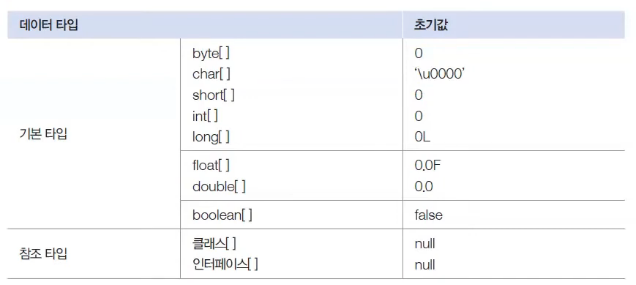
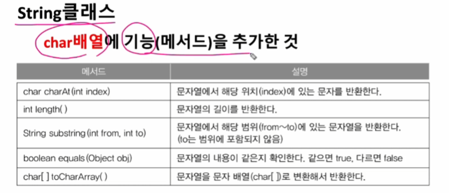

# 📦 배열 (Array)

> **작성 일시:** 2026-02-26 오후 3:06

---

## 1. 배열이란?

변수는 **하나의 값만 저장**할 수 있다.

만약 같은 타입의 데이터를 여러 개 저장해야 한다면 변수를 여러 개 만들어야 하는 불편함이 있다.

👉 이런 문제를 해결하기 위해 사용하는 것이 **배열(Array)** 이다.

---

## ✅ 배열의 정의


> **같은 타입의 데이터를 연속된 메모리 공간에 저장하고,
각 데이터에 인덱스(index)를 부여한 자료구조**이다.


- 인덱스는 **0부터 시작**
- 연속된 공간에 저장됨
- 같은 타입만 저장 가능

---

## ✅ 배열의 특징 

1. 같은 타입의 데이터만 저장 가능
2. 한 번 생성하면 **길이 변경 불가**
3. 배열 변수는 **참조 변수**
4. 실제 데이터는 힙(Heap)에 저장
5. 배열 변수는 스택(Stack)에 주소값 저장

---

## 2. 배열 선언과 생성

### 📌 배열 선언

```java
타입[] 변수명;
타입 변수명[];
```

```java
int[5] arr; // 5개의 값을 저장할 수 있는 배열 생성
```



---

### 📌 배열 생성

```java
변수명 = new 타입[길이];
```

예시:

```java
int[] score = new int[5]; // 5개의 값을 저장할 수 있는 배열 생성
```

---

### 📌 선언과 동시에 초기화

```java
int[] arr = new int[] {1, 2, 3, 4, 5};
int[] arr2 = {10, 20, 30, 40, 50}; // new int[] 생략 가능
```

---

## ✅ 배열의 인덱스

배열은 0부터 시작한다.

```java
score[0] = 10;
score[1] = 20;
score[2] = 30;
score[3] = 40;
score[4] = 50;
```

**---**

## 3. 객체를 참조하는 배열 

배열은 **저장하는 데이터의 종류**에 따라  
저장 방식이 완전히 달라진다.

---

### ✅ 기본 타입 배열

기본 타입 배열은

> **각 항목에 실제 값(Value)을 직접 저장**한다.


```java
int[] arr = {10, 20, 30};
```

메모리 구조

```
arr → [10][20][30]
        값  값  값
```


- 배열 안에 **값 자체가 들어감**
- 별도의 객체 생성 없음

---

### ✅ 참조 타입 배열 (객체 배열)

> **참조 타입 배열은 각 항목에 객체의 번지(주소값)를 저장**한다.

대표적인 참조 타입

- 클래스
- String
- 인터페이스
- 배열

---

### 📌 예시 1 — String 배열

```java
String[] strArr = {"Java", "Spring", "JPA"};
```

실제 구조:

```
strArr → [주소][주소][주소]
            ↓     ↓     ↓
         "Java" "Spring" "JPA"
```

👉 배열에는 **문자열이 저장되는 것이 아니라**
👉 문자열 객체의 **주소값만 저장됨**

---

### 📌 예시 2 — 객체 배열

```java
Student[] students = new Student[3];
```

```
students → [null][null][null]
```

아직 객체 생성이 안 됨.

객체를 넣어야 실제 사용 가능

```java
students[0] = new Student();
students[1] = new Student();
students[2] = new Student();
```

---

### ⚠️ 중요한 차이점 

| 구분 | 저장되는 것 |
|------|-------------|
| 기본 타입 배열 | 실제 값 |
| 참조 타입 배열 | 객체의 주소값 |

---

### ⚠️ NullPointerException 주의

참조 배열은 객체를 생성하지 않으면  
각 요소는 **기본값 null** 상태이다.

```java
Student[] arr = new Student[3];
arr[0].name = "홍길동";  // ❌ NullPointerException
```

👉 반드시 객체 생성 후 사용해야 한다.

```java
arr[0] = new Student();
arr[0].name = "홍길동";
```

---

##  한 줄 정리

> **기본 배열 = 값 저장**  
> **객체 배열 = 주소 저장**

---


## 4. 배열의 길이

배열의 길이는 저장 가능한 항목 수를 의미한다.


```java
배열변수.length;
```


```java
int[] arr = new int[5];
System.out.println(arr.length); // 5
```

⚠️ length는 읽기만 가능, 변경 불가

---

## 5. 배열 반복 (순회)

### 📌 일반 for문

```java
for (int i = 0; i < arr.length; i++) {
    arr[i] = i;
}
```

---

### 📌 향상된 for문 (Enhanced for)

배열과 컬렉션을 더 쉽게 처리할 때 사용한다.

```java
for (타입 변수 : 배열) {
    실행문;
}
```


```java
for (int element : arr) {
    System.out.println(element);
}
```

특징:

- 인덱스 사용 불가
- 읽기 전용 반복에 적합

---

## 6. 배열 출력

배열을 그냥 출력하면 주소값이 출력된다.

```java
System.out.println(arr); 
// [I@7ad041f3 (주소값)
```

---

### 📌 값 출력 방법

1️⃣ 반복문 사용  
2️⃣ Arrays.toString() 사용

```java
import java.util.Arrays;

System.out.println(Arrays.toString(arr));
```

---

## 7. 배열 복사

배열은 생성 후 길이 변경이 불가능하다.

데이터가 많아질 경우 → 새 배열을 생성하고 복사해야 한다.


---

### 📌 직접 복사

```java
int[] arr = {1, 2, 3, 4, 5};
int[] tmp = new int[arr.length * 2];

for (int i = 0; i < arr.length; i++) {
    tmp[i] = arr[i];
}

arr = tmp;
```

---

### 📌 System.arraycopy()

```java
System.arraycopy(arr1, 0, arr2, 0, arr1.length);
```

---

### 📌 Arrays.copyOf()


```java
arr2 = Arrays.copyOf(arr1, arr1.length);
```

---

## 8. 배열 정렬

### 📌 오름차순 정렬

```java
Arrays.sort(arr);
```

---

### ⚠️ 내림차순 정렬 주의

기본 타입 배열은

```java
Arrays.sort(arr, Collections.reverseOrder());
```

❌ 사용 불가 (기본형 배열에는 적용되지 않음)

✔ 해결 방법:

```java
Integer[] arr = {3, 5, 1, 2, 4};
Arrays.sort(arr, Collections.reverseOrder());
```

→ 반드시 Wrapper 타입 사용

---

## 9. 배열 비교

### 📌 Arrays.equals()

```java
Arrays.equals(arr1, arr2);
```

값을 비교한다.

---

## 10. String 배열과 문자열 메서드



### 📌 charAt()

```java
String str = "ABCDE";
char ch = str.charAt(2); // C
```

---

### 📌 substring()

```java
String str = "012345";
String tmp = str.substring(1, 4); // 123
```

(1 이상 4 미만)

---

### 📌 char 배열 ↔ String 변환

```java
char[] chArr = {'c', 'h', 'a', 'r'};
String str = new String(chArr);

char[] tmp = str.toCharArray();
```

---
## 11. 다차원 배열 (2차원 배열)

2차원 배열은 **배열 안에 배열이 들어 있는 구조**이다.

테이블 형태 (행 × 열) 구조를 가진다.

---

### 📌 생성 방법

```java
int[][] arr = new int[4][3];
```

---

### 📌 선언과 동시에 초기화

(※ 원본 오류 수정: = 누락 보완)

```java
int[][] score = {
    {100, 100, 100},
    {20, 100, 95},
    {50, 80, 90},
    {80, 60, 100}
};
```

---

### 📌 2차원 배열 순회

```java
for (int i = 0; i < score.length; i++) {
    for (int j = 0; j < score[i].length; j++) {
        System.out.print(score[i][j] + " ");
    }
}
```


