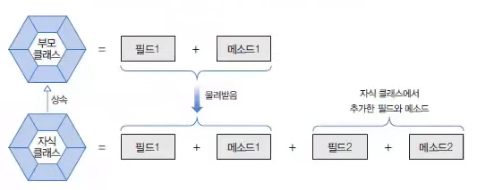
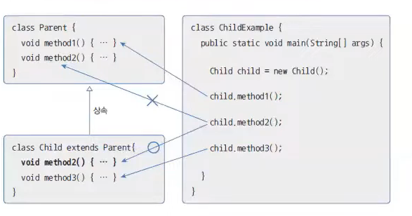
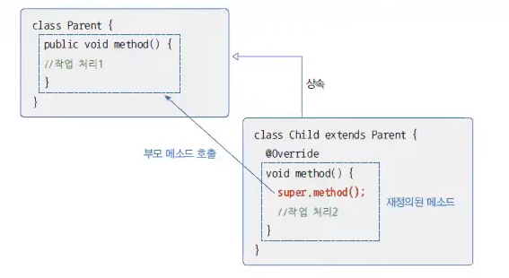
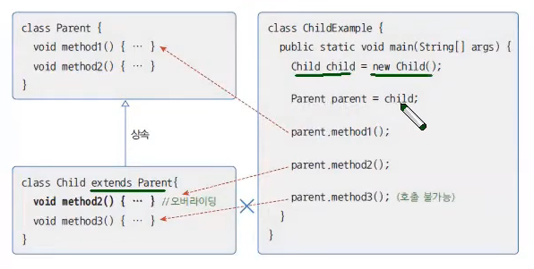
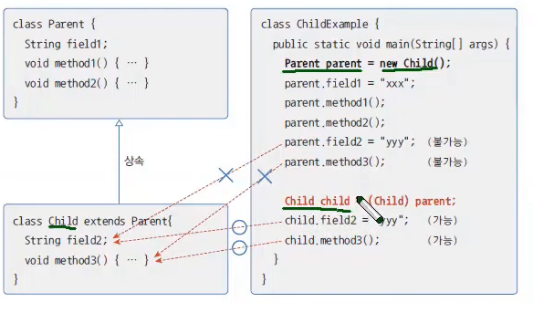
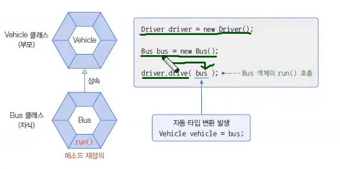
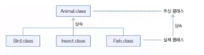

# 📌 상속 핵심 정리
작성 일시: 2026-03-03 오후 1:54

------------------------------------------------------------

## 1️⃣ 상속 (Inheritance)

상속은 부모가 자식에게 물려주는 행위를 말한다.<br>
객체지향 프로그램에서 **부모 클래스의 인스턴스 멤버를 자식 클래스에게 물려주는 것**이다.

### ✔[상속의 장점] 
- 코드 재사용성 증가
- 코드 중복 감소 → 개발 시간 단축
- 유지보수 용이

### ✔클래스 상속 문법
``` java
public class 자식 extends 부모 { }
```
- 상속은 자식이 부모를 선택
- 자바는 다중 상속을 허용하지 않는다 (단일 상속)

------------------------------------------------------------

## 2️⃣ 부모 생성자 호출

자식 객체를 생성하면 **부모 객체가 먼저 생성된 후 자식 객체가 생성된다.**

``` java
 자식클래스 변수 = new 자식클래스();
```
모든 객체는 생성자를 호출해야만 생성된다.
상속을 하면 부모 생성자는 자식 생성자의 **맨 첫 줄에 숨겨져 있다.**

```
public 자식클래스() {
super();
}
```

- super()는 부모의 기본 생성자를 호출
- 컴파일 과정에서 자동 추가

### ✔ 부모에 기본 생성자가 없는 경우
```java
public 자식클래스() {
super(매개값);
}
```
- 부모 클래스에 매개변수 생성자만 존재하면 반드시 명시적으로 호출해야 한다.
- 그렇지 않으면 컴파일 에러 발생

------------------------------------------------------------

## 3️⃣ 메소드 재정의 (Override)

메소드 재정의는 오버라이딩(Overriding) 을 의미한다.
자식 클래스는 부모의 메소드를 자신의 기능에 맞게 다시 정의할 수 있다.

### ✔ 오버라이딩 조건
- 부모 메소드와 선언부 동일
  (리턴 타입, 메소드명, 매개변수)
- 접근 제한을 더 좁게 변경 불가
- 새로운 예외를 추가로 throws 할 수 없음

### ✔ 부모 메소드 호출

```java
@Override
public void method() {
super.method();
}
```

- 오버라이딩하면 부모 메소드는 가려진다.
- super.메소드명()으로 부모 메소드 호출 가능

------------------------------------------------------------

## 4️⃣ final 클래스와 final 메소드

### ✔ final 클래스
```java
public final class 클래스 {}
```
- 더 이상 상속 불가
- 확장 금지 목적

### ✔ final 메소드
```java
public final void method() {}
```
- 자식 클래스에서 재정의 불가

------------------------------------------------------------

## 5️⃣ 타입 변환 (Casting)

클래스 타입 변환은 상속 관계에서만 발생한다.

### ✔ 자동 타입 변환 (Upcasting)
```jav
부모타입 변수 = new 자식타입();
```

- 자식 → 부모 자동 변환
- 부모에 선언된 필드와 메소드만 접근 가능
- 오버라이딩된 메소드는 자식 메소드 실행 (다형성 핵심)

>예: 고양이는 동물이다.

### ✔ 강제 타입 변환 (Downcasting)

```jav
자식타입 변수 = (자식타입) 부모타입객체;
```
- 부모 → 자식 자동 변환 불가
- 명시적 캐스팅 필요
- 실제 객체가 자식일 때만 가능

------------------------------------------------------------

## 6️⃣ 다형성 (Polymorphism)

사용 방법은 동일하지만 실행 결과가 다양하게 나오는 성질

### ✔ 성립 조건
- 자동 타입 변환
- 메소드 오버라이딩

## ✔ 필드 다형성
필드 타입은 같지만 대입 객체가 달라지면 실행 결과가 달라진다.


### ✔ 매개변수 다형성

```java
void method(부모 p) {}
method(new 자식());
```

------------------------------------------------------------

### 7️⃣ 객체 타입 확인 (instanceof) 

객체의 실제 타입을 확인할 때 사용

```java
if (obj instanceof 자식) {
자식 c = (자식) obj;
}
```
- 타입 변환 가능 여부 확인 목적

------------------------------------------------------------

##  8️⃣ 추상 클래스 (Abstract Class)

공통 특성을 추출한 개념


예:
새, 곤충, 물고기 → 생명

### ✔ 추상 클래스 선언

```java
public abstract class 클래스명 {}
```
- 객체 직접 생성 불가
- 상속을 통해 자식 클래스만 생성 가능

###  ✔ 추상 메소드
```java
public abstract void method();
```
- 선언만 존재
- 실행 내용 없음
- 자식 클래스에서 반드시 구현해야 함