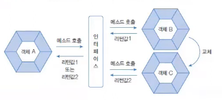
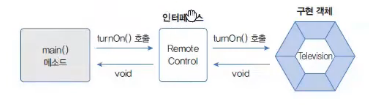
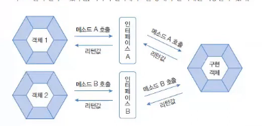
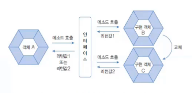

# 📌  인터페이스 정리
작성 일시: 2026-03-04 오후 1:44

------------------------------------------------------------

## 1. 인터페이스 (Interface)

인터페이스는 사전적으로 두 장치를 연결하는 접속기를 의미한다.<br>
자바에서 인터페이스는 다형성을 구현하는 핵심 기술이다.



> .java 파일로 작성되며 컴파일되면 .class 파일이 된다.
> 물리적 형태는 클래스와 동일하다.

------------------------------------------------------------

# 2. 인터페이스 선언
인터페이스는 **class** 키워드 대신에 **interface**키워드를 사용한다.

```java
interface 인터페이스명 {
    // 상수 필드
    // 추상 메서드
    // 생성자
    // 디폴트 메서드
    // 정적 메서드
    // private 메소드
}     

public interface 인터페이스명 {
    public static final 타입 상수이름 = 값;
    public abstract 타입 메서드이름(매개변수목록);
} 
```
인터페이스 내부에는 다음 멤버를 가질 수 있다.

- 상수 필드
- 추상 메소드
- 디폴트 메소드
- 정적 메소드
- private 메소드

## 예시
```java
interface Tv {
    int MAX_VOLUME = 10; 
    int MIN_VOLUME = 10;
    
    void turnOn();
    public static void turnOff();
}     

```

------------------------------------------------------------

# 3. 구현 클래스 선언

인터페이스를 사용하려면 **implements** 키워드를 사용한다.<br>
구현을 하게 되면 인터페이스에 정의된 **모든 추상 메서드는 재정의**해야한다.

```java
public class A implements 인터페이스명 {
    // 추상 메소드 재정의 필수
}
```



## 예시
```java
public class SmartTv implements Tv {
    // 추상 메소드 재정의 필수
    @Override
    public void turnOn() {
        System.out.println("전원이 켜집니다.");
    }

    @Override
    public void turnOff() {
        System.out.println("전원이 꺼집니다.!");
    }
}
```

------------------------------------------------------------

# 4. 상수 필드

인터페이스의 모든 필드는 자동으로 public static final 이다.<br>
불변의 상수 필드 멤버를 가질 수 있다.

```java
[public static final] 타입 변수명 = 값;
```
**public static final 은 생략 가능**하며
**컴파일 과정에서 자동으로 추가**된다.

상수명은 관례적으로 대문자 + _ 사용

예:
## 예시
```java
public interface Tv {
    int MAX_SPEED = 100;
    public static final int MIN_SPEED = 20; // public static final 생략가능 
}
```

------------------------------------------------------------

# 5. 추상 메소드

구현 클래스가 반드시 재정의해야 하는 메소드

```java
[public abstract] 리턴타입 메소드명(매개변수);
```
**public abstract는 생략 가능**하며
컴파일에서 자동으로 추가된다.

※ 추상 메소드는 실행부 {} 가 없다.

## 예시
```java
public abstract void move(int x);
int add(int x, int y); // public abstract는 생략 가능
```
------------------------------------------------------------

# 6. 디폴트 메소드

완전한 실행 코드를 가진 메소드

```java
default 리턴타입 메소드명(매개변수) {
실행코드
}
```

- 구현 클래스에서 재정의 가능
- 실행부 {} 존재

## 예시
```java
default void run(int x) {
    System.out.println(x+"만큼 걸음");
}
```

------------------------------------------------------------

# 7. 정적 메소드
추상메소드와 디폴트 메소드는 구현 객체가 필요<br>
인터페이스는 구현 객체 없이 인터페이스 이름으로 호출 가능

```java
[public | private] static 리턴타입 메소드명(매개변수) {
실행코드

```

인터페이스명.메소드명();

## 예제
```java
public interface RemoteControl {
    // 1. 정적 메서드 선언
    static void changeBattery() {
        System.out.println("건전지를 교환합니다.");
    }

    // 비교를 위한 추상 메서드
    void turnOn();
}

public class Main {
    public static void main(String[] args) {
        // 2. 구현 객체 없이 인터페이스명으로 직접 호출 가능
        RemoteControl.changeBattery();
        
        /* 참고: 
        Television tv = new Television();
        tv.changeBattery(); // (X) 구현 객체로는 호출할 수 없음
        */
    }
}
```

------------------------------------------------------------

# 8. private 메소드

private 메소드는 디폴트 메소드나 정적 메소드 내부에서만 호출 가능 <br>

## 예제
```java
public interface RemoteControl {
    default void turnOn() {
        commonLogic(); // 중복 코드 호출
        System.out.println("전원을 켭니다.");
    }

    default void turnOff() {
        commonLogic(); // 중복 코드 호출
        System.out.println("전원을 끕니다.");
    }

    // private 메서드로 공통 로직 관리
    private void commonLogic() {
        System.out.println("기기 상태를 점검합니다.");
    }
}
```

용도:
- 중복 코드 제거
- 내부 로직 분리

------------------------------------------------------------

# 9. 다중 인터페이스 구현

구현 클래스는 여러 개의 인터페이스를 동시에 구현할 수 있다.

```java
public class A implements 인터페이스1, 인터페이스2 {
// 모든 추상 메소드 구현
}
```



## 예제
```java
public interface Searchable {
    void search(String url);
}


// 두 개의 인터페이스를 동시에 구현
public class SmartTV implements RemoteControl, Searchable {
    @Override
    public void turnOn() { System.out.println("스마트 TV를 켭니다."); }
    
    @Override
    public void search(String url) { System.out.println(url + "을 검색합니다."); }
}
```

※ 클래스는 다중 상속 불가
※ 인터페이스는 다중 구현 가능

------------------------------------------------------------

# 10. 인터페이스 타입 변환

(1) 자동 타입 변환

인터페이스 변수 = 구현객체;

예:
RemoteControl rc = new Television();

(2) 강제 타입 변환

구현클래스 변수 = (구현클래스) 인터페이스변수;

## 예제

```java
RemoteControl rc = new SmartTV(); // 자동 타입 변환
Searchable s = (Searchable) rc;   // 강제 타입 변환 (rc가 SmartTV이므로 가능)
```
------------------------------------------------------------

# 11. 인터페이스와 다형성

사용 방법은 동일하지만
구현 객체에 따라 실행 결과가 달라진다.



자동 타입 변환 + 메소드 재정의 = 다형성

------------------------------------------------------------

# 12. 객체 타입 확인

인터페이스에서도 instanceof 사용 가능

if (obj instanceof 구현클래스) {
구현클래스 변수 = (구현클래스) obj;
}

## 예제
```java
public class Main {
    public static void checkDevice(RemoteControl rc) {
        // 1. 구형 방식
        if (rc instanceof SmartTV) {
            SmartTV stv = (SmartTV) rc;
            stv.search("naver.com");
        }

        // 2. Java 12+ 패턴 매칭 방식 (권장)
        if (rc instanceof Television tv) {
            System.out.println("이 기기는 일반 TV입니다.");
        } else if (rc instanceof SmartTV stv) {
            System.out.println("이 기기는 스마트 TV입니다.");
            stv.search("google.com");
        }
    }
}
```
------------------------------------------------------------

# 13. 핵심 정리

- 인터페이스는 다형성 구현의 핵심 도구
- 모든 필드는 public static final
- 모든 추상 메소드는 public abstract
- implements로 구현
- 다중 구현 가능
- 타입 변환 가능