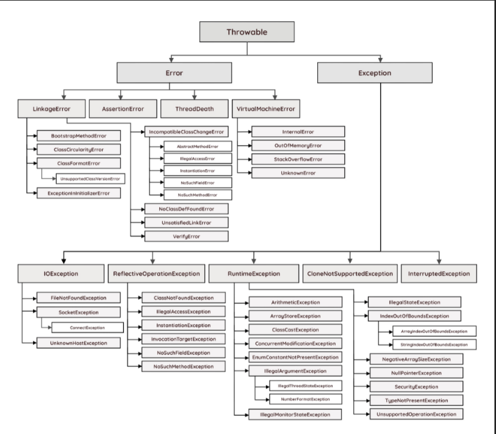
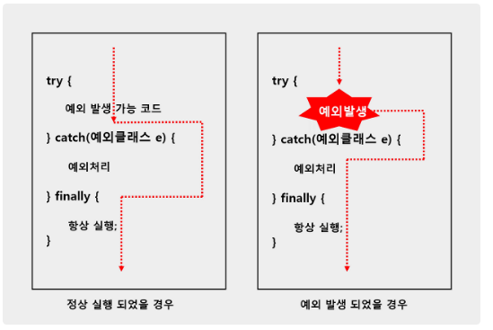

# 📚 Java 예외 처리

> 작성 일시: 2026-03-05 오후 2:44

---

## 1. 에러(Error) vs 예외(Exception)
프로그램 실행 중 발생하는 오류를 자바에서는 크게 두 가지로 분류.

- **에러(Error):** 하드웨어 고장 등 프로그램 코드로 수습될 수 없는 심각한 오류.
- **예외(Exception):** 사용자의 잘못된 조작이나 프로그래머의 코딩 실수로 발생하는 오류. 예외 처리를 통해 프로그램을 계속 실행 상태로 유지할 수 있음.

### [오류의 종류]
| 종류 | 발생 시점 및 특징 |
| :--- | :--- |
| **컴파일 에러** | 문법 오류로 인해 컴파일 시점에 발생 |
| **런타임 에러** | 실행 중 발생하며, 프로그램이 비정상 종료됨 |
| **논리적 에러** | 실행은 되지만 개발자의 의도와 다르게 동작함 |

---

## 2. 예외의 분류
자바는 예외가 발생하면 해당 예외 클래스로부터 객체를 생성하여 관리.



### ✔ 일반 예외 (Checked Exception)
**특징:** 컴파일러가 예외 처리 코드 여부를 반드시 검사함. 처리하지 않으면 컴파일 불가.

- FileNotFoundException(존재하지 않는 파일 이름을 입력한 경우)

- ClassNotFoundException(클래스 이름을 잘못 작성한 경우)

- DataFormatException(입력 데이터 형식이 잘못된 경우)

### ✔ 실행 예외 (RuntimeException)
**특징:** 프로그래머의 실수로 발생하며, 컴파일러가 예외 처리 여부를 검사하지 않음.
- IndexOutOfBoundsException(배열의 범위를 벗어난 경우)

- NullPointerException(null 참조 변수의 멤버를 호출한 경우)

- ClassCastException(잘못된 형 변환)

- ArithmeticException(정수를 0으로 나누는 경우)

- NumberFormatException(문자열을 숫자로 변환할 때 형식이 맞지 않는 경우)

- InputMismatchException(입력 데이터 타입이 맞지 않는 경우)

---

## 3. 예외 처리 코드 (try-catch-finally)
예외 발생 시 프로그램의 갑작스러운 종료를 막고 정상 실행을 유지하기 위해 사용.



### 문법
```java
try {
 예외 발생 가능한 코드
} catch(예외 클래스 e) {
예외 처리
} finally{
항상 실행 -> 예외가 발생하든 말든 항상 실행구문 작성.
}
```

### 💻 예제 코드
```java
public class ExceptionExample {
    public static void main(String[] args) {
        try {
            String data = null;
            System.out.println(data.toString()); // NullPointerException 발생 가능
        } catch (NullPointerException e) {
            System.out.println("예외 발생: 객체가 없는 상태에서 호출되었습니다.");
            System.out.println("원인: " + e.getMessage());
        } finally {
            System.out.println("프로그램 실행 완료 (항상 실행)");
        }
    }
}
```
---
# 4. 예외 떠넘기기 (throws)
메소드 내부에서 예외를 직접 처리하지 않고, 메소드를 호출한 곳으로 예외 처리를 넘기는 방식 이때 사용하는 키워드 **throws**이다.<br>
throws는 메소드 선언부 끝에 작성하는데, 떠넘길 예외 클래스를 쉼표로 구분해서 나열해주면된다

``` java
리턴타입 메소드명(매개변수, ...) throws 예외클래스1, 예외클래스2, ... {}
```

### 💻 예제 코드
``` java
public class ThrowsExample {

    public static void main(String[] args) throws Exception {
        readFile();   // 예외를 여기로 전달
        System.out.println("프로그램 종료");
    }

    public static void readFile() throws Exception {
        System.out.println("파일 읽기 시작");

        // 강제로 예외 발생
        throw new Exception("파일을 찾을 수 없습니다.");

        // 예외 발생 후 아래 코드는 실행되지 않음
        // System.out.println("파일 읽기 완료");
    }
}
```

throws가 붙어 있는 메소드에서 해당 예외를 처리하지 않고 떠넘김 -> 따라서 이 메소드를 호출한 곳으로 예외를받아 처리 해야한다.
<br><br>
나열해야할 예외 클래스가 많을 경우 **throws Exception or throws Throwable**만으로 모든 예외를 간단히 떠넘길 수 있다.
``` java
리턴타입 메소드명(매개변수, ...) throws Exception {}
```

### 💻 예제 코드
```java
import java.io.FileReader;
import java.io.IOException;

public class ThrowsExample2 {

    public static void main(String[] args) throws IOException {
        readFile();
    }

    public static void readFile() throws IOException {
        FileReader file = new FileReader("test.txt");
        file.read();
        file.close();
    }
}
```
main() 메소드에서도, throws 키워드를 사용해서 예외를 떠넘길 수 있는데, 결국 JVM이 최종적으로 예외를 처리 하게된다.

``` java
public static void main(String\[] args) throws Exception {}
```

### 💻 예제 코드
```java
public class ThrowsExample3 {

    public static void main(String[] args) throws Exception {
        divide(10, 0);
    }

    public static int divide(int a, int b) throws ArithmeticException, Exception {
        if (b == 0) {
            throw new ArithmeticException("0으로 나눌 수 없습니다.");
        }

        return a / b;
    }
}
```

---
# 5. 사용자 정의 예외 (커스텀 에외)
자바에서 제공하는 표준 라이브러리에 없는 예외를 직접 정의하고, 특정 조건에서 강제로 발생시킬 수 있다.

사용자 정의 예외는 다음 두 가지 방식으로 만들 수 있다.

- 일반 예외 → Exception 상속
- 실행 예외 → RuntimeException 상속

```java
public class XXXException extends Exception {

    public XXXException() {}

    public XXXException(String message) {
        super(message);
    }
}
```
### 💻 예제 코드
```java
//사용자 정의 예외 클래스
public class InvalidAgeException extends Exception {

    // 기본 생성자
    public InvalidAgeException() {}

    // 메시지 전달 생성자
    public InvalidAgeException(String message) {
        super(message);
    }
}
```

- 기본 생성자
- 메시지를 전달받는 생성자

메시지를 부모 생성자로 전달하는 이유는  
**getMessage() 메소드를 사용하기 위해서이다.**
---
#  6. 예외 발생 시키기

직접 예외를 발생시키려면 **throw 키워드**를 사용한다.

```java
throw new Exception();
throw new RuntimeException();
throw new CustomException();
```

### 💻 예제 코드
```java
// 예외 발생 코드
public class AgeValidator {

    public static void validate(int age) throws InvalidAgeException {

        if (age < 0) {
            throw new InvalidAgeException("나이는 0보다 작을 수 없습니다.");
        }

        if (age < 18) {
            throw new InvalidAgeException("성인만 가입 가능합니다.");
        }

        System.out.println("가입 가능한 나이입니다.");
    }
}

// 실행 코드
public class Main {

    public static void main(String[] args) {

        try {
            AgeValidator.validate(15);
        } catch (InvalidAgeException e) {
            System.out.println("예외 발생: " + e.getMessage());
        }

        System.out.println("프로그램 종료");
    }
}
```

### 실행 결과 및 흐름
```java
// 실행 결과
예외 발생: 성인만 가입 가능합니다.
프로그램 종료

// 실행 흐름
main()
   ↓
           AgeValidator.validate()
   ↓
조건 검사
   ↓
           throw new InvalidAgeException()
   ↓
           catch 블록에서 처리
```


메시지를 함께 전달할 수도 있다.

```java
throw new Exception("예외 발생");
```

---

# 🚩 핵심 요약 정리

- Error → 시스템 오류
- Exception → 프로그램에서 처리 가능

예외 종류

- Checked Exception (컴파일 예외)
- RuntimeException (실행 예외)

예외 처리 방법

- try - catch - finally
- throws (예외 떠넘기기)
- throw (예외 직접 발생)

사용자 정의 예외

- Exception 상속 → 일반 예외
- RuntimeException 상속 → 실행 예외
  
출처: https://inpa.tistory.com/entry/JAVA-☕-에러Error-와-예외-클래스Exception-💯-총정리 [Inpa Dev 👨‍💻:티스토리] 이미지 및 내용 