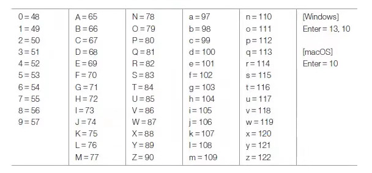

# System 클래스

> 작성 일시: 2026-03-10 오후 2:04

자바 프로그램은 **운영체제(OS) 위에서 직접 실행되는 것이 아니라 JVM(Java Virtual Machine)** 위에서 실행된다.  
따라서 운영체제의 모든 기능을 자바 코드로 직접 접근하기는 어렵다.

하지만 `java.lang` 패키지에 있는 **System 클래스**를 이용하면 운영체제의 일부 기능을 사용할 수 있다.

System 클래스의 **정적 필드와 메소드**를 이용하면 다음 기능을 사용할 수 있다.

- 프로그램 종료
- 키보드 입력
- 콘솔 출력
- 현재 시간 읽기
- 시스템 프로퍼티 읽기
- 환경 변수 읽기

---

# 1. System 클래스 주요 멤버

| 구분 | 이름 | 용도 |
|---|---|---|
필드 | out | 콘솔(모니터)에 문자 출력 |
필드 | err | 콘솔(모니터)에 에러 내용 출력 |
필드 | in | 키보드 입력 |
메소드 | exit(int status) | 프로세스 종료 |
메소드 | currentTimeMillis() | 현재 시간을 밀리초 단위로 반환 |
메소드 | nanoTime() | 현재 시간을 나노초 단위로 반환 |
메소드 | getProperty(String key) | 시스템 프로퍼티 정보 반환 |
메소드 | getenv(String name) | 운영체제 환경 변수 반환 |

---

# 2. 콘솔 출력

`System.out` 필드를 사용하면 콘솔에 문자열을 출력할 수 있다.

`System.err` 역시 콘솔에 출력하지만  
일부 콘솔 환경에서는 **에러 메시지가 빨간색으로 출력**된다.

## 예제 코드

```java
public class SystemOutExample {

    public static void main(String[] args) {

        System.out.println("일반 출력 메시지");
        System.err.println("에러 출력 메시지");

    }

}
```

출력

```
일반 출력 메시지
에러 출력 메시지
```

---

# 3. 키보드 입력

자바에서는 키보드 입력을 받기 위해 `System.in` 필드를 사용한다.

```java
int keyCode = System.in.read();
```

특징

- `read()`는 **Enter 키를 누르기 전까지 대기 상태**
- 입력된 문자를 **정수(ASCII 코드)** 로 반환
- `IOException` 예외 처리가 필요
- 



## 예제 코드

```java
import java.io.IOException;

public class KeyboardInputExample {

    public static void main(String[] args) throws IOException {

        System.out.println("문자를 입력하세요:");

        int keyCode = System.in.read();

        System.out.println("입력된 키 코드: " + keyCode);

    }

}
```

---

# 4. 프로세스 종료(JVM 종료)

운영체제는 실행 중인 프로그램을 **프로세스(Process)** 로 관리한다.

자바 프로그램이 실행되면 **JVM 프로세스가 생성되고 main() 메소드가 실행**된다.

프로세스를 강제로 종료하려면 `System.exit()` 메소드를 사용한다. -> JVM 종료를 의미함

```java
System.exit(int status);
```

### 종료 상태값(status)

| 값 | 의미 |
|---|---|
0 | 정상 종료 |
1 또는 -1 | 비정상 종료 |


## 예제 코드

```java
public class ExitExample {

    public static void main(String[] args) {

        System.out.println("프로그램 종료");

        System.exit(0);

    }

}
```

---

# 5. 진행 시간 읽기

`System` 클래스는 프로그램 실행 시간을 측정하기 위한 메소드를 제공한다.

| 메소드 | 설명 |
|---|---|
long currentTimeMillis() | 1/1000초 단위 시간 반환 |
long nanoTime() | 나노초 단위 시간 반환 |

이 메소드들은 **프로그램 처리 시간 측정**에 자주 사용된다.


## 예제 코드 (실행 시간 측정)

```java
public class TimeExample {

    public static void main(String[] args) {

        long start = System.currentTimeMillis();

        for(int i = 0; i < 1000000; i++) {
            int result = i * i;
        }

        long end = System.currentTimeMillis();

        System.out.println("실행 시간: " + (end - start) + "ms");

    }

}
```

---

# 6. 시스템 프로퍼티 읽기

**시스템 프로퍼티(System Property)** 는 자바 프로그램 실행 시 자동으로 설정되는 **시스템 정보**이다.

예

- 운영체제 정보
- 사용자 정보
- 자바 버전

시스템 프로퍼티는 `System.getProperty()` 메소드로 읽을 수 있다.


## 주요 시스템 프로퍼티

| 속성 이름(Key) | 설명 | 값 예시 |
|---|---|---|
java.specification.version | 자바 스펙 버전 | 21 |
java.home | JDK 설치 경로 | C:\Program Files\Java\jdk-21 |
os.name | 운영체제 이름 | Windows 10 |
user.name | 사용자 이름 | user |
user.home | 사용자 홈 디렉토리 | C:\Users\user |
user.dir | 현재 작업 디렉토리 | C:\project |

---

## 예제 코드

```java
public class SystemPropertyExample {

    public static void main(String[] args) {

        System.out.println("Java Version: " + System.getProperty("java.specification.version"));
        System.out.println("Java Home: " + System.getProperty("java.home"));
        System.out.println("OS Name: " + System.getProperty("os.name"));
        System.out.println("User Name: " + System.getProperty("user.name"));
        System.out.println("User Home: " + System.getProperty("user.home"));
        System.out.println("Current Dir: " + System.getProperty("user.dir"));

    }

}
```

---

# 7. 환경 변수 읽기

운영체제의 환경 변수는 `System.getenv()` 메소드로 읽을 수 있다.

## 예제 코드

```java
public class EnvExample {

    public static void main(String[] args) {

        String path = System.getenv("PATH");

        System.out.println("PATH 환경 변수:");
        System.out.println(path);

    }

}
```

---

# 정리

| 기능 | 사용 메소드 |
|---|---|
콘솔 출력 | System.out.println() |
에러 출력 | System.err.println() |
키보드 입력 | System.in.read() |
프로세스 종료 | System.exit() |
시간 측정 | currentTimeMillis(), nanoTime() |
시스템 정보 | getProperty() |
환경 변수 | getenv() |