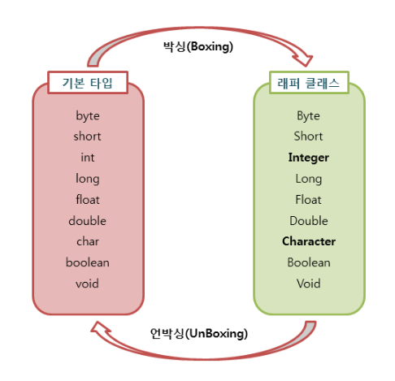
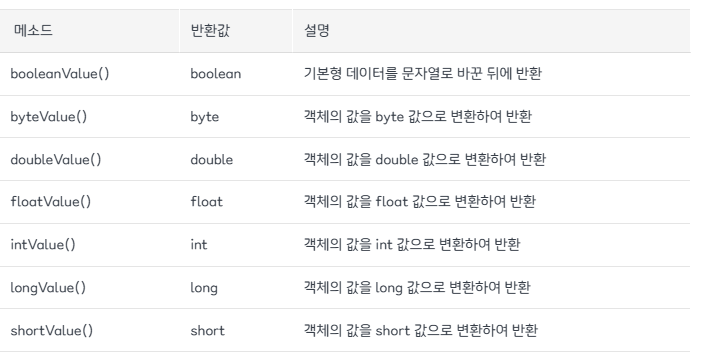

# 포장 클래스 (Wrapper Class)

> 작성 일시: 2026-03-07  오전 11:02

자바에서는 기본 타입의 값을 **객체 형태로 사용할 수 있도록 하는 클래스**를 제공한다.  
이러한 객체를 **포장 객체(Wrapper Object)** 라고 한다.

포장 객체는 **기본 타입의 값을 내부에 포장하고 있는 객체**이기 때문에 붙여진 이름이다.

포장 클래스는 **java.lang 패키지**에 포함되어 있다.

---

# 1. 기본 타입과 포장 클래스

| 기본 타입 | 포장 클래스 |
|---|---|
| byte | Byte |
| short | Short |
| int | Integer |
| long | Long |
| float | Float |
| double | Double |
| char | Character |
| boolean | Boolean |

규칙
- 기본 타입 이름의 **첫 글자를 대문자로 변경한 클래스 이름**
- 예외
    - `int → Integer`
    - `char → Character`

---

# 2. 박싱(Boxing)과 언박싱(Unboxing)



## 박싱 (Boxing)

기본 타입의 값을 **포장 객체로 변환하는 과정**

## 언박싱 (Unboxing)

포장 객체에서 **기본 타입 값을 꺼내는 과정**

---



## 예제

```java
// 박싱 (Auto Boxing)
Integer obj = 100;  
Integer num = new Integer(20);

// 언박싱 (Auto Unboxing)
int value = obj;
int n = num.intValue();

// 재 포장(박싱)
n = n + 100; // 120
num = new Integer(n);
```

출력

```
100
```

---

# 3. 연산 과정에서의 언박싱

포장 객체는 연산에 사용될 때 **자동으로 언박싱**이 발생한다.

```java
Integer obj = 100;

int result = obj + 50;  // obj가 자동 언박싱

System.out.println(result);
```

출력

```
150
```

---

# 4. 문자열을 기본 타입으로 변환

포장 클래스는 **문자열(String)을 기본 타입으로 변환할 때**도 사용된다.

대부분의 포장 클래스는 다음과 같은 **정적 메소드**를 제공한다.

```
parse + 기본타입
```

예
- parseInt()
- parseDouble()
- parseLong()

---

## 예제

```java
public class Main {

    public static void main(String[] args) {

        String str1 = "100";
        String str2 = "3.14";

        int num1 = Integer.parseInt(str1);
        double num2 = Double.parseDouble(str2);

        System.out.println(num1 + 50);
        System.out.println(num2 + 1);

    }

}
```

출력

```
150
4.14
```

---

# 5. 포장 객체 값 비교

포장 객체는 **== 연산자로 내부 값을 비교하면 안 된다.**

이유  
`==` 연산자는 **객체의 값이 아니라 객체의 주소(번지)** 를 비교하기 때문이다.

---

## 잘못된 비교 예제

```java
Integer o1 = new Integer(100);
Integer o2 = new Integer(100);

System.out.println(o1 == o2); // false
```

출력

```
false
```

이유  
두 객체의 **메모리 주소가 다르기 때문**

---

# 6. 올바른 비교 방법 (equals)

포장 객체의 값을 비교할 때는 **equals() 메소드**를 사용해야 한다.

포장 클래스의 `equals()` 메소드는 **내부 값을 비교하도록 재정의되어 있다.**

---

## 예제

```java
Integer o1 = 100;
Integer o2 = 100;

System.out.println(o1.equals(o2));
```

출력

```
true
```

---

# 7. 정리

| 개념 | 설명 |
|---|---|
포장 클래스 | 기본 타입 값을 객체로 다루기 위한 클래스 |
박싱 | 기본 타입 → 객체 변환 |
언박싱 | 객체 → 기본 타입 변환 |
parse 메소드 | 문자열 → 기본 타입 변환 |
equals() | 포장 객체 내부 값 비교 |

출처: https://inpa.tistory.com/entry/JAVA-☕-wrapper-class-Boxing-UnBoxing [Inpa Dev 👨‍💻:티스토리]