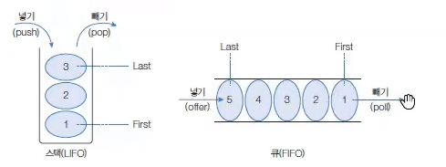

# LIFO와 FIFO 컬렉션

컬렉션 프레임워크에는 **LIFO와 FIFO 구조를 사용하는 컬렉션**이 존재한다.

```
LIFO (Last In First Out)  : 후입선출
FIFO (First In First Out) : 선입선출
```



---

# LIFO (후입선출)

```
나중에 들어온 데이터가 먼저 나가는 구조
```

예

```
책 쌓기
접시 쌓기
```

대표적인 예

```
JVM Stack 메모리
```

스택 메모리에 저장된 변수는 **나중에 저장된 것부터 제거된다.**

---

# FIFO (선입선출)

```
먼저 들어온 데이터가 먼저 나가는 구조
```

예

```
줄 서기
프린터 대기열
```

대표적인 예

```
스레드 풀 작업 큐
```

작업 큐는 **먼저 들어온 작업부터 처리한다.**

---

# Stack

Stack 클래스는 **LIFO 자료구조를 구현한 클래스**이다.

구조

```
Push → 데이터 저장
Pop → 데이터 제거
Peek → 맨 위 데이터 확인
```

---

# Stack 생성 방법

```java
Stack<E> stack = new Stack<E>();
Stack<E> stack = new Stack<>();
```

예

```java
Stack<Integer> stack = new Stack<>();
```

---

# Stack 주요 메소드

| 리턴 타입 | 메소드 | 설명 |
|---|---|---|
E | push(E item) | 스택에 객체 저장 |
E | pop() | 스택에서 객체 제거 후 반환 |
E | peek() | 스택의 최상단 객체 반환 (제거 X) |
boolean | empty() | 스택이 비어있는지 확인 |
int | search(Object o) | 객체 위치 반환 |

---

# Stack 예제 코드

```java
import java.util.Stack;

public class StackExample {

    public static void main(String[] args) {

        Stack<Integer> stack = new Stack<>();

        stack.push(10);
        stack.push(20);
        stack.push(30);

        System.out.println("현재 Stack: " + stack);

        System.out.println("peek(): " + stack.peek());

        while(!stack.empty()){
            System.out.println("pop(): " + stack.pop());
        }

    }

}
```

출력 예

```
현재 Stack: [10, 20, 30]
peek(): 30
pop(): 30
pop(): 20
pop(): 10
```

---

# Queue

Queue 인터페이스는 **FIFO 구조를 구현하는 컬렉션 인터페이스**이다.

Queue는 **먼저 들어온 데이터가 먼저 처리되는 구조**이다.

---

# Queue 주요 메소드

| 리턴 타입 | 메소드 | 설명 |
|---|---|---|
boolean | offer(E e) | 큐에 객체 추가 |
E | poll() | 큐에서 객체 제거 후 반환 |
E | peek() | 큐의 첫 번째 객체 반환 |
boolean | isEmpty() | 큐가 비어있는지 확인 |

---

# Queue 구현 클래스

Queue 인터페이스를 구현한 대표적인 클래스

```
LinkedList
PriorityQueue
ArrayDeque
```

가장 많이 사용하는 구현 클래스

```
LinkedList
```

---

# Queue 생성 방법

```java
Queue<E> queue = new LinkedList<E>();
Queue<E> queue = new LinkedList<>();
```

예

```java
Queue<Integer> queue = new LinkedList<>();
```

---

# Queue 예제 코드

```java
import java.util.LinkedList;
import java.util.Queue;

public class QueueExample {

    public static void main(String[] args) {

        Queue<Integer> queue = new LinkedList<>();

        queue.offer(10);
        queue.offer(20);
        queue.offer(30);

        System.out.println("현재 Queue: " + queue);

        while(!queue.isEmpty()){
            System.out.println("poll(): " + queue.poll());
        }

    }

}
```

출력 예

```
현재 Queue: [10, 20, 30]
poll(): 10
poll(): 20
poll(): 30
```

---

# Stack vs Queue

| 구분 | Stack | Queue |
|---|---|---|
구조 | LIFO | FIFO |
의미 | 후입선출 | 선입선출 |
대표 메소드 | push / pop | offer / poll |
사용 예 | JVM Stack | 작업 큐 |

---

# 정리

LIFO

```
Stack
```

FIFO

```
Queue
```

대표 구현

```
Stack → Stack 클래스
Queue → LinkedList
```