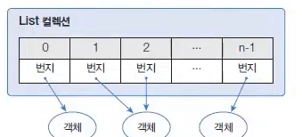
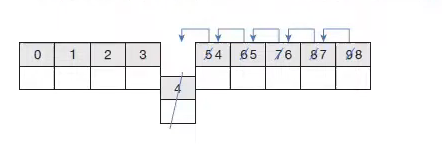
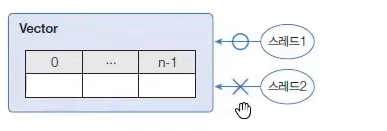
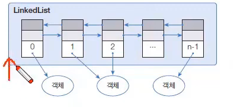
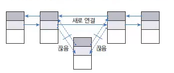

# List 컬렉션

> 작성 일시: 2026-03-14 오전 11:10

List 컬렉션은 **객체를 인덱스(Index)로 관리하는 컬렉션**이다.  
객체를 저장하면 자동으로 인덱스가 부여되며, 객체를 **검색, 추가, 삭제**할 수 있다.

대표적인 List 구현 클래스

```
ArrayList
LinkedList
Vector
```

List 컬렉션은 **인덱스로 관리되기 때문에 인덱스를 매개값으로 사용하는 메소드가 많다.**

---

# List 인터페이스 주요 메소드

| 기능 | 메소드 | 설명 |
|---|---|---|
객체 추가 | boolean add(E e) | 주어진 객체를 맨 끝에 추가 |
객체 추가 | void add(int index, E element) | 주어진 인덱스에 객체 추가 |
객체 수정 | E set(int index, E element) | 주어진 인덱스의 객체를 새로운 객체로 변경 |
객체 검색 | boolean contains(Object o) | 주어진 객체가 저장되어 있는지 확인 |
객체 검색 | E get(int index) | 주어진 인덱스의 객체를 반환 |
객체 검색 | boolean isEmpty() | 컬렉션이 비어있는지 검사 |
객체 검색 | int size() | 저장된 전체 객체 수 반환 |
객체 삭제 | void clear() | 모든 객체 삭제 |
객체 삭제 | E remove(int index) | 주어진 인덱스의 객체 삭제 |
객체 삭제 | boolean remove(Object o) | 주어진 객체 삭제 |

---

# ArrayList

ArrayList는 **List 컬렉션에서 가장 많이 사용하는 컬렉션**이다.

ArrayList에 객체를 추가하면 **내부 배열에 객체가 저장된다.**

배열과 차이점

```
배열 → 크기 고정
ArrayList → 크기 자동 증가
```

또한 List 컬렉션은 **객체 자체를 저장하는 것이 아니라 객체의 주소(참조값)** 를 저장한다.

특징

```
중복 저장 가능
null 저장 가능
순서 유지
```

---

## ArrayList 선언

```java
List<E> list = new ArrayList<E>();
List<E> list = new ArrayList<>();
List list = new ArrayList();
```
타입 파라미터 `E`에는 ArrayList에 저장하고 싶은 객체 타입을 지정하면 된다. (제네릭 파트 참고)

`List`에 지정한 객체 타입과 동일하다면 `ArrayList<>`와 같이 **객체 타입을 생략**할 수 있다.

예

```java
List<String> list = new ArrayList<>();
```

타입을 모두 생략하면 **모든 종류의 객체를 저장할 수 있으며 내부적으로 Object 타입으로 처리된다.**

```java
List list = new ArrayList();
```

ArrayList 컬렉션에 객체를 추가하면 **인덱스 0번부터 순서대로 저장된다.**

또한 배열 기반 구조이기 때문에 **데이터 이동이 발생할 수 있다.**

예

- 특정 인덱스의 객체를 제거하면  
  → 바로 뒤 인덱스부터 마지막 인덱스까지 **모두 앞으로 한 칸씩 이동한다.**

- 특정 인덱스에 객체를 삽입하면  
  → 해당 인덱스부터 마지막 인덱스까지 **모두 뒤로 한 칸씩 이동한다.**

이러한 이유로 **중간 데이터 삽입이나 삭제가 빈번한 경우 성능이 떨어질 수 있다.**



설명

```
List<E> list = new ArrayList<>(); 
→ E 타입 객체만 저장 가능

List list = new ArrayList();
→ 모든 타입(Object) 저장 가능
```

---

## ArrayList 예제 코드

```java
import java.util.ArrayList;
import java.util.List;

public class ArrayListExample {

    public static void main(String[] args) {

        List<String> list = new ArrayList<>();

        list.add("Java");
        list.add("Spring");
        list.add("Database");

        System.out.println(list);

        System.out.println(list.get(1));

        list.remove(0);

        System.out.println(list);

        System.out.println("크기: " + list.size());

    }

}
```

출력

```
[Java, Spring, Database]
Spring
[Spring, Database]
크기: 2
```

---

# Vector

Vector는 **ArrayList와 동일한 내부 구조(배열)** 를 가지고 있다.

차이점

```
Vector → 동기화(Synchronized)
ArrayList → 비동기
```

Vector는 **멀티 스레드 환경에서 객체를 추가 또는 삭제를 할 수 있다.**

하지만 성능 문제로 **현재는 ArrayList를 더 많이 사용한다.**

---

## Vector 선언

```java
List<E> list = new Vector<E>();
List<E> list = new Vector<>();
List list = new Vector();
```

설명

```
Vector<E>
→ 지정한 타입만 저장

Vector
→ 모든 타입(Object) 저장
```

---

## Vector 예제 코드

```java
import java.util.List;
import java.util.Vector;

public class VectorExample {

    public static void main(String[] args) {

        List<String> list = new Vector<>();

        list.add("Java");
        list.add("Spring");
        list.add("Database");

        for (String s : list) {
            System.out.println(s);
        }

    }

}
```

출력

```
Java
Spring
Database
```

---

# LinkedList

LinkedList는 **ArrayList와 사용 방법은 같지만 내부 구조가 다르다.**

구조

```
ArrayList → 배열 구조
LinkedList → 노드 연결 구조
```

LinkedList는 **객체를 체인처럼 연결하여 관리한다.**

```
Node → Node → Node
```

---

## LinkedList 특징

```
객체 삽입/삭제 성능 좋음
중간 데이터 처리 빠름
```


예

```
데이터 삽입
데이터 삭제
```

---

## LinkedList 선언

```java
List<E> list = new LinkedList<E>();
List<E> list = new LinkedList<>();
List list = new LinkedList();
```

LinkedList는 특정 위치에서 객체를 삽입하거나 삭제할 경우 **앞뒤 노드의 링크만 변경하면 된다.**

구조 예시

```
Node1 → Node2 → Node3 → Node4
```

만약 Node2를 삭제하면

```
Node1 → Node3 → Node4
```

처럼 **앞뒤 링크만 수정하면 되기 때문에 데이터 이동이 발생하지 않는다.**

따라서 다음과 같은 경우 **ArrayList보다 성능이 좋다.**

```
데이터 삽입이 많은 경우
데이터 삭제가 많은 경우
```

반대로 **데이터 조회가 많은 경우에는 ArrayList가 더 좋은 성능을 가진다.**

설명

```
LinkedList<E>
→ 지정 타입만 저장

LinkedList
→ 모든 타입 저장
```

---

## LinkedList 예제 코드

```java
import java.util.LinkedList;
import java.util.List;

public class LinkedListExample {

    public static void main(String[] args) {

        List<String> list = new LinkedList<>();

        list.add("Java");
        list.add("Spring");
        list.add("Database");

        list.add(1, "JPA");

        System.out.println(list);

        list.remove(2);

        System.out.println(list);

    }

}
```

출력

```
[Java, JPA, Spring, Database]
[Java, JPA, Database]
```

---

# ArrayList vs LinkedList 성능 차이

| 구분 | ArrayList | LinkedList |
|---|---|---|
구조 | 배열 | 노드 연결 |
조회 | 빠름 | 느림 |
삽입 | 느림 | 빠름 |
삭제 | 느림 | 빠름 |

---

# 정리

```
ArrayList
→ 조회 성능 좋음

LinkedList
→ 삽입/삭제 성능 좋음

Vector
→ 멀티 스레드 안전 (현재는 잘 사용 안함)
```

출처: 

https://www.youtube.com/watch?v=mENlwGb2H7A&list=PLVsNizTWUw7EmX1Y-7tB2EmsK6nu6Q10q&index=147