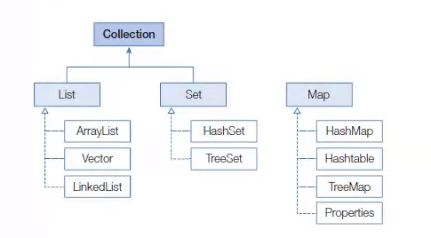

# 컬렉션 프레임워크 (Collection Framework)

> 작성 일시: 2026-03-13 오후 2:20

컬렉션 프레임워크는 `java.util` 패키지에 포함된 **인터페이스와 클래스들의 집합**으로  
객체를 효율적으로 **추가, 삭제, 검색**할 수 있도록 제공되는 자바의 자료구조 라이브러리이다.

자바에서 널리 사용되는 **자료구조(Data Structure)** 를 표준화하여 제공한다.

---

# 배열과 컬렉션 차이

배열 예시

```java
Member[] members = new Member[10];

members[0] = new Member();
```

## 배열의 특징

- 같은 타입만 저장 가능
- 배열 길이를 변경할 수 없음
- 크기를 늘리려면 **새 배열 생성 후 복사 필요**

예

```java
Member[] newMembers = new Member[20];

System.arraycopy(members, 0, newMembers, 0, members.length);
```

이러한 불편함을 해결하기 위해 **컬렉션 프레임워크**가 사용된다.

---

# 컬렉션 프레임워크 구조

컬렉션 프레임워크의 주요 인터페이스

```
List
Set
Map
```

구조



설명

- `List`와 `Set`은 **Collection 인터페이스를 상속**
- `Map`은 **키와 값 구조**이기 때문에 별도의 인터페이스

---

# 컬렉션 인터페이스 분류

| 인터페이스 분류 | 컬렉션 종류 | 특징 | 구현 클래스 |
|---|---|---|---|
| Collection | List | - 순서(Index)를 유지하고 저장 <br> - 중복 저장 가능 | ArrayList, Vector, LinkedList |
| Collection | Set | - 순서(Index)를 유지하지 않음 <br> - 중복 저장 불가 | HashSet, TreeSet |
| Map | Map | - 키(Key)와 값(Value)으로 구성된 엔트리 저장 <br> - 키는 중복 저장 불가 | HashMap, Hashtable, TreeMap, Properties |

---

# 1. List 인터페이스

특징

- 저장 순서 유지
- Index로 접근 가능
- 중복 저장 가능

대표 구현 클래스

```
ArrayList
LinkedList
Vector
```

## ArrayList 예제

```java
import java.util.ArrayList;
import java.util.List;

public class ListExample {

    public static void main(String[] args) {

        List<String> list = new ArrayList<>();

        list.add("Java");
        list.add("Spring");
        list.add("Database");
        list.add("Java");

        System.out.println(list);

        System.out.println(list.get(0));

        list.remove(1);

        System.out.println(list);

    }

}
```

출력

```
[Java, Spring, Database, Java]
Java
[Java, Database, Java]
```

---

# 2. Set 인터페이스

특징

- 순서 없음
- 중복 저장 불가
- Index 없음

대표 구현 클래스

```
HashSet
TreeSet
```

## HashSet 예제

```java
import java.util.HashSet;
import java.util.Set;

public class SetExample {

    public static void main(String[] args) {

        Set<String> set = new HashSet<>();

        set.add("Java");
        set.add("Spring");
        set.add("Java");

        System.out.println(set);

        System.out.println(set.contains("Java"));

    }

}
```

출력

```
[Java, Spring]
true
```

설명

```
Java 중복 저장 안됨
```

---

# 3. Map 인터페이스

특징

- Key + Value 구조
- Key는 중복 불가
- Value는 중복 가능

대표 구현 클래스

```
HashMap
Hashtable
TreeMap
Properties
```

## HashMap 예제

```java
import java.util.HashMap;
import java.util.Map;

public class MapExample {

    public static void main(String[] args) {

        Map<String, Integer> map = new HashMap<>();

        map.put("Java", 90);
        map.put("Spring", 95);
        map.put("Database", 85);

        System.out.println(map);

        System.out.println(map.get("Java"));

        map.remove("Database");

        System.out.println(map);

    }

}
```

출력

```
{Java=90, Spring=95, Database=85}
90
{Java=90, Spring=95}
```

---

# 정리

| 인터페이스 | 특징 |
|---|---|
List | 순서 유지, 중복 허용 |
Set | 순서 없음, 중복 불가 |
Map | Key-Value 구조 |

---

# 핵심 정리

```
List
→ 순서 O
→ 중복 O

Set
→ 순서 X
→ 중복 X

Map
→ Key-Value 구조
→ Key 중복 X
```

출처:
https://www.youtube.com/watch?v=zBaKVHysspg&list=PLVsNizTWUw7EmX1Y-7tB2EmsK6nu6Q10q&index=146