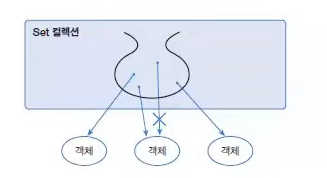
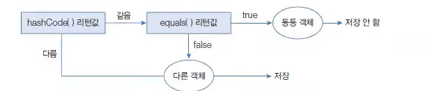

# Set 컬렉션

> 작성 일시: 2026-03-15 오전 11:10

List 컬렉션은 **저장 순서를 유지**하지만 Set 컬렉션은 **저장 순서를 유지하지 않는다.**

Set 컬렉션 특징

```
객체 중복 저장 불가
null은 하나만 저장 가능
```

Set 컬렉션은 **수학의 집합(Set)** 개념과 비슷하다.

집합의 특징

```
순서 없음
중복 없음
```

---

# Set 구현 클래스

대표적인 Set 컬렉션

```
HashSet
LinkedHashSet
TreeSet
```


Set 컬렉션은 **인덱스로 관리하지 않기 때문에 인덱스를 사용하는 메소드가 없다.**

---

# Set 인터페이스 주요 메소드

| 기능 | 메소드 | 설명 |
|---|---|---|
객체 추가 | boolean add(E e) | 객체 저장, 성공하면 true 중복이면 false |
객체 검색 | boolean contains(Object o) | 객체가 저장되어 있는지 확인 |
객체 검색 | boolean isEmpty() | 컬렉션이 비어있는지 확인 |
객체 검색 | Iterator<E> iterator() | 반복자 반환 |
객체 검색 | int size() | 저장된 객체 수 반환 |
객체 삭제 | void clear() | 모든 객체 삭제 |
객체 삭제 | boolean remove(Object o) | 객체 삭제 |

---

# HashSet

Set 컬렉션 중에서 **가장 많이 사용하는 구현 클래스**가 HashSet이다.

HashSet은 **해시 알고리즘을 사용하여 객체를 저장한다.**

---

## HashSet 선언

```java
Set<E> set = new HashSet<E>(); 
Set<E> set = new HashSet<>();
Set set = new HashSet();
```

설명

```
Set<E> set = new HashSet<>();
→ 지정한 타입만 저장 가능

Set set = new HashSet();
→ 모든 타입(Object) 저장 가능
```

타입 파라미터 `E`에는 HashSet에 저장할 객체 타입을 지정하면 된다.

예

```java
Set<String> set = new HashSet<>();
```

---

# HashSet 중복 저장 기준

HashSet은 **객체가 중복인지 판단할 때 다음 두 메소드를 사용한다.**

```
hashCode()
equals()
```

동작 방식

```
1. hashCode() 값 비교
2. equals() 결과 비교
```



조건

```
hashCode() 값이 같고
equals() 결과가 true
```

이면 **동일 객체로 판단하여 저장하지 않는다.**

---

# String 객체 저장 시

문자열을 HashSet에 저장할 경우

```
같은 문자열 → 동일 객체로 판단
```

이유

```
String 클래스는
hashCode()와 equals()가 문자열 값을 기준으로 재정의되어 있기 때문
```

---

# HashSet 예제 코드

```java
import java.util.HashSet;
import java.util.Set;

public class HashSetExample {

    public static void main(String[] args) {

        Set<String> set = new HashSet<>();

        set.add("Java");
        set.add("Spring");
        set.add("Database");
        set.add("Java");

        System.out.println(set);
        System.out.println("크기: " + set.size());

    }

}
```

출력

```
[Java, Spring, Database]
크기: 3
```

---

# Set 컬렉션 반복 방법

Set 컬렉션은 **인덱스가 없기 때문에 get() 메소드가 없다.** 

-> 객체를 검색해서 가져오는 메소드가 없다

따라서 객체를 가져올 때 **반복문을 사용해야 한다.**

방법

```
1. for-each 문
2. Iterator
```

---

# 방법 1 : for-each

```java
import java.util.HashSet;
import java.util.Set;

public class SetForEachExample {

    public static void main(String[] args) {

        Set<String> set = new HashSet<>();

        set.add("Java");
        set.add("Spring");
        set.add("JPA");

        for(String s : set){
            System.out.println(s);
        }

    }

}
```

---

# 방법 2 : Iterator 사용

```java
Set<E> set = new HashSet<>();
Iterator<E> iterator = set.iterator();
```

Iterator는 **Set 컬렉션의 객체를 하나씩 가져오는 반복자이다.**

---

# Iterator 주요 메소드

| 리턴 타입 | 메소드 | 설명 |
|---|---|---|
boolean | hasNext() | 가져올 객체가 있으면 true |
E | next() | 다음 객체 반환 |
void | remove() | 현재 객체 삭제 |

---

hasNext) 메소드로 가져올 객체가 있는 먼저 검사

true를 리턴할때 마다 next()로 객체를 가져옴

만약 next()로 가져온 객체를 컬렉션에서 제거하고 싶다면 remove()사용


# Iterator 예제 코드

```java
import java.util.HashSet;
import java.util.Iterator;
import java.util.Set;

public class IteratorExample {

    public static void main(String[] args) {

        Set<String> set = new HashSet<>();

        set.add("Java");
        set.add("Spring");
        set.add("Database");

        Iterator<String> iterator = set.iterator();

        while(iterator.hasNext()) {

            String value = iterator.next();
            System.out.println(value);

        }

    }

}
```

---

# Iterator remove 예제

```java
Iterator<String> iterator = set.iterator();

while(iterator.hasNext()){

    String value = iterator.next();

    if(value.equals("Spring")){
        iterator.remove();
    }

}
```

---

# 정리

```
Set 특징
순서 없음
중복 저장 불가
null 하나만 가능
```

대표 구현 클래스

```
HashSet
LinkedHashSet
TreeSet
```

반복 방법

```
for-each
Iterator
```