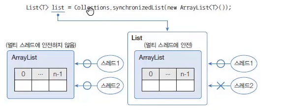
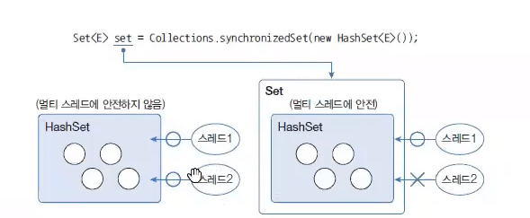
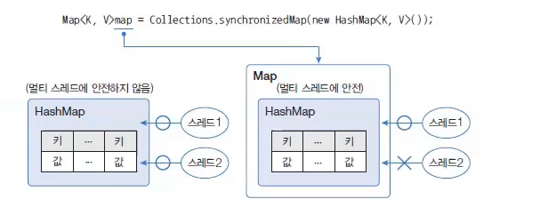

# 동기화된 컬렉션 (Synchronized Collection)

> 작성 일시: 2026-03-17 오후 4:10

컬렉션 프레임워크의 대부분의 클래스들은 **싱글 스레드 환경에서 사용하도록 설계되어 있다.**

즉, 여러 스레드가 동시에 컬렉션에 접근하면 **데이터가 의도하지 않게 변경되는 문제가 발생할 수 있다.**

이러한 상태를 **스레드 안전하지 않다(Thread Unsafe)** 라고 한다.

---

# 기본적으로 동기화된 컬렉션

다음 컬렉션들은 **내부 메소드가 synchronized로 구현되어 있어 멀티 스레드 환경에서 안전하다.**

```
Vector
Hashtable
```

하지만 다음 컬렉션들은 **동기화되어 있지 않다. -> 비동기화에 특화**

```
ArrayList
HashSet
HashMap
```

따라서 멀티 스레드 환경에서 사용할 경우 **데이터 충돌 문제가 발생할 수 있다.**

---

# Collections 클래스의 동기화 메소드

멀티 스레드 환경에서 **ArrayList, HashSet, HashMap을 안전하게 사용하려면**

```
Collections.synchronizedXXX()
```

메소드를 사용하여 **동기화된 컬렉션으로 변환(래핑)** 할 수 있다.

---

# synchronized 메소드 종류

| 리턴 타입 | 메소드 | 설명 |
|---|---|---|
List<T> | synchronizedList(List<T> list) | List를 동기화된 List로 반환 |
Set<T> | synchronizedSet(Set<T> set) | Set을 동기화된 Set으로 반환 |
Map<K,V> | synchronizedMap(Map<K,V> map) | Map을 동기화된 Map으로 반환 |

이 메소드들은 **비동기 컬렉션을 매개값으로 전달하면 동기화된 컬렉션을 반환한다.**

---

# ArrayList 동기화

```java
List<T> list = Collections.synchronizedList(new ArrayList<T>());
```



> List는 여러 스레드를 동시에 사용하지 못한다.

예

```java
import java.util.ArrayList;
import java.util.Collections;
import java.util.List;

public class SynchronizedListExample {

    public static void main(String[] args) {

        List<Integer> list =
                Collections.synchronizedList(new ArrayList<>());

        list.add(10);
        list.add(20);
        list.add(30);

        System.out.println(list);

    }

}
```

---

# HashSet 동기화

```java
Set<T> set = Collections.synchronizedSet(new HashSet<T>());
```



> Set은 여러 스레드를 동시에 사용하지 못한다.


예

```java
import java.util.Collections;
import java.util.HashSet;
import java.util.Set;

public class SynchronizedSetExample {

    public static void main(String[] args) {

        Set<String> set =
                Collections.synchronizedSet(new HashSet<>());

        set.add("Java");
        set.add("Spring");
        set.add("Database");

        System.out.println(set);

    }

}
```

---

# HashMap 동기화

```java
Map<K,V> map = Collections.synchronizedMap(new HashMap<K,V>());
```



> Map 여러 스레드를 동시에 사용하지 못한다.

예

```java
import java.util.Collections;
import java.util.HashMap;
import java.util.Map;

public class SynchronizedMapExample {

    public static void main(String[] args) {

        Map<String, Integer> map =
                Collections.synchronizedMap(new HashMap<>());

        map.put("Java", 90);
        map.put("Spring", 95);
        map.put("Database", 85);

        System.out.println(map);

    }

}
```

---

# 동기화 컬렉션 특징

```
멀티 스레드 환경에서 안전
동시에 하나의 스레드만 접근 가능
성능이 다소 떨어질 수 있음
```

---

# 정리

기본 동기화 컬렉션

```
Vector
Hashtable
```

비동기 컬렉션

```
ArrayList
HashSet
HashMap
```

동기화 방법

```
Collections.synchronizedList()
Collections.synchronizedSet()
Collections.synchronizedMap()
```