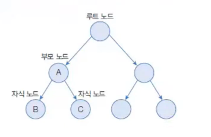
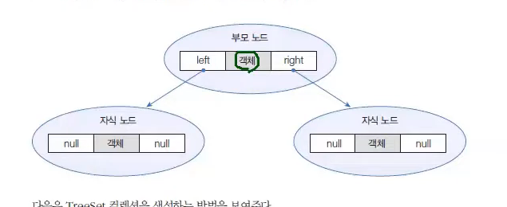
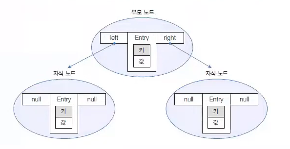

# 검색 기능을 강화한 컬렉션

> 작성 일시: 2026-03-16 오후 2:20

컬렉션 프레임워크는 **검색 기능이 강화된 컬렉션**으로 다음을 제공한다.

```
TreeSet
TreeMap
```

이 컬렉션들은 **이진 트리(Binary Tree)** 구조를 기반으로 데이터를 저장한다.

---

# TreeSet

TreeSet은 **이진 트리 기반의 Set 컬렉션**이다.

이진 트리는 여러 개의 노드(Node)가 **트리 형태로 연결된 구조**이다.

특징
```java
검색과 자동정렬 하는데 좋다.
```
구조 특징

```
루트 노드(Root Node)에서 시작
각 노드는 최대 2개의 자식 노드를 가질 수 있음
```

TreeSet에 객체를 저장하면 **자동으로 정렬된다.**

정렬 기준

```
부모 노드보다 값이 작으면 → 왼쪽 자식 노드
부모 노드보다 값이 크면 → 오른쪽 자식 노드
```



---

# TreeSet 생성 방법

```java
TreeSet<E> treeSet = new TreeSet<E>();
TreeSet<E> treeSet = new TreeSet<>();
```

예

```java
TreeSet<Integer> treeSet = new TreeSet<>();
```

Set 타입으로 선언할 수도 있다.

```java
Set<Integer> set = new TreeSet<>();
```

하지만 **TreeSet 타입으로 선언하면 검색 관련 메소드를 사용할 수 있다.**

---

# TreeSet 주요 검색 메소드

| 리턴 타입 | 메소드 | 설명                             |
|---|---|--------------------------------|
E | first() | 가장 낮은 객체 반환(제일 앞에 있는걸 가져옴)     |
E | last() | 가장 높은 객체 반환 (제일 뒤에 있는걸 가져옴)    |
E | lower(E e) | 주어진 객체보다 바로 아래 객체              |
E | higher(E e) | 주어진 객체보다 바로 위 객체               |
E | floor(E e) | 같으면 반환, 없으면 바로 아래 객체           |
E | ceiling(E e) | 같으면 반환, 없으면 바로 위 객체            |
E | pollFirst() | 가장 낮은 객체 반환 후 제거(제일 앞에 있는걸 제거) |
E | pollLast() | 가장 높은 객체 반환 후 제거(제일 뒤에 있는걸 제거) |
Iterator<E> | descendingIterator() | 내림차순 반복자 반환                    |
NavigableSet<E> | descendingSet() | 내림차순 Set 반환                    |
NavigableSet<E> | headSet(E toElement, boolean inclusive) | 주어진 값보다 낮은 객체 반환               |
NavigableSet<E> | tailSet(E fromElement, boolean inclusive) | 주어진 값보다 높은 객체 반환               |
NavigableSet<E> | subSet(E from, boolean fromInclusive, E to, boolean toInclusive) | 범위 검색                          |

---

# TreeSet 예제 코드

```java
import java.util.TreeSet;

public class TreeSetExample {

    public static void main(String[] args) {

        TreeSet<Integer> treeSet = new TreeSet<>();

        treeSet.add(90);
        treeSet.add(80);
        treeSet.add(70);
        treeSet.add(100);
        treeSet.add(85);

        System.out.println("전체: " + treeSet);

        System.out.println("최소값: " + treeSet.first());
        System.out.println("최대값: " + treeSet.last());

        System.out.println("85보다 아래 값: " + treeSet.lower(85));
        System.out.println("85보다 위 값: " + treeSet.higher(85));

    }

}
```

출력 예

```
전체: [70, 80, 85, 90, 100]
최소값: 70
최대값: 100
85보다 아래 값: 80
85보다 위 값: 90
```

---

# TreeMap

TreeMap은 **이진 트리 기반 Map 컬렉션**이다.

TreeMap은 **키 기준으로 정렬** 된다.

TreeSet과 차이점

```
TreeSet → 값 저장
TreeMap → Key + Value 저장
```

TreeMap에 데이터를 저장하면 **Key 기준으로 자동 정렬된다.**

정렬 방식

```
부모 Key보다 작으면 → 왼쪽 노드
부모 Key보다 크면 → 오른쪽 노드
```

---

# TreeMap 생성 방법

```java
TreeMap<K, V> treeMap = new TreeMap<K, V>();
TreeMap<K, V> treeMap = new TreeMap<>();
```

예

```java
TreeMap<String, Integer> treeMap = new TreeMap<>();
```

Map 타입으로 선언 가능

```java
Map<String, Integer> map = new TreeMap<>();
```

하지만 **TreeMap 타입으로 선언하면 검색 관련 메소드를 사용할 수 있다.**

---

# TreeMap 주요 메소드

| 리턴 타입 | 메소드 | 설명 |
|---|---|---|
Map.Entry<K,V> | firstEntry() | 가장 낮은 Key Entry |
Map.Entry<K,V> | lastEntry() | 가장 높은 Key Entry |
Map.Entry<K,V> | lowerEntry(K key) | 주어진 Key보다 바로 아래 Entry |
Map.Entry<K,V> | higherEntry(K key) | 주어진 Key보다 바로 위 Entry |
Map.Entry<K,V> | floorEntry(K key) | 같으면 반환, 없으면 바로 아래 Entry |
Map.Entry<K,V> | ceilingEntry(K key) | 같으면 반환, 없으면 바로 위 Entry |
Map.Entry<K,V> | pollFirstEntry() | 가장 낮은 Entry 반환 후 제거 |
Map.Entry<K,V> | pollLastEntry() | 가장 높은 Entry 반환 후 제거 |
NavigableSet<K> | descendingKeySet() | 내림차순 Key Set |
NavigableMap<K,V> | descendingMap() | 내림차순 Map |
NavigableMap<K,V> | headMap(K toKey, boolean inclusive) | 주어진 Key보다 낮은 Entry |
NavigableMap<K,V> | tailMap(K fromKey, boolean inclusive) | 주어진 Key보다 높은 Entry |
NavigableMap<K,V> | subMap(K from, boolean fromInc, K to, boolean toInc) | 범위 검색 |

---

# TreeMap 예제 코드

```java
import java.util.Map;
import java.util.TreeMap;

public class TreeMapExample {

    public static void main(String[] args) {

        TreeMap<String, Integer> map = new TreeMap<>();

        map.put("Java", 90);
        map.put("Spring", 95);
        map.put("Database", 85);
        map.put("JPA", 88);

        System.out.println("전체: " + map);

        Map.Entry<String, Integer> entry = map.firstEntry();

        System.out.println("가장 낮은 Key: " + entry.getKey() + " : " + entry.getValue());

        entry = map.lastEntry();

        System.out.println("가장 높은 Key: " + entry.getKey() + " : " + entry.getValue());

    }

}
```

---

# Comparable

TreeSet과 TreeMap은 **저장 시 자동 정렬**이 된다.

하지만 **모든 객체가 정렬 가능한 것은 아니다.**

객체가 정렬되기 위해서는 **Comparable 인터페이스를 구현해야 한다.**

이미 구현된 클래스

```
Integer
Double
String
```

사용자 정의 객체는 직접 구현해야 한다.

---

# Comparable 인터페이스

| 리턴 타입 | 메소드 | 설명 |
|---|---|---|
int | compareTo(T o) | 객체 비교 |

비교 기준

```
같으면 → 0
작으면 → 음수
크면 → 양수
```

---

# Comparable 예제

```java
class Person implements Comparable<Person>{

    String name;
    int age;

    Person(String name, int age){
        this.name = name;
        this.age = age;
    }

    @Override
    public int compareTo(Person o){
        return this.age - o.age;
    }

}
```

TreeSet 사용

```java
import java.util.TreeSet;

public class ComparableExample {

    public static void main(String[] args) {

        TreeSet<Person> set = new TreeSet<>();

        set.add(new Person("Kim", 30));
        set.add(new Person("Lee", 20));
        set.add(new Person("Park", 40));

        for(Person p : set){
            System.out.println(p.name + " : " + p.age);
        }

    }

}
```

---

# Comparator

Comparable을 구현하지 않은 객체도 **Comparator를 사용하면 정렬 가능하다.**

TreeSet / TreeMap 생성 시 **Comparator 객체를 전달하면 된다.**

---

# TreeSet Comparator 사용

```java
TreeSet<E> treeSet = new TreeSet<E>(new ComparatorImpl());
```

TreeMap

```java
TreeMap<K, V> treeMap = new TreeMap<K, V>(new ComparatorImpl());
```

---

# Comparator 인터페이스

| 리턴 타입 | 메소드 | 설명 |
|---|---|---|
int | compare(T o1, T o2) | 두 객체 비교 |

비교 기준

```
o1 == o2 → 0
o1이 앞 → 음수
o1이 뒤 → 양수
```

---

# Comparator 예제

```java
import java.util.Comparator;

class PersonComparator implements Comparator<Person>{

    @Override
    public int compare(Person o1, Person o2){
        return o1.age - o2.age;
    }

}
```

사용 예

```java
TreeSet<Person> set = new TreeSet<>(new PersonComparator());
```

---

# 정리

Tree 기반 컬렉션

```
TreeSet
TreeMap
```

특징

```
이진 트리 구조
자동 정렬
검색 기능 강화
범위 검색 가능
```

정렬 방식

```
Comparable
Comparator
```

출처:
https://www.youtube.com/watch?v=3E_wnilNY_w&list=PLVsNizTWUw7EmX1Y-7tB2EmsK6nu6Q10q&index=150