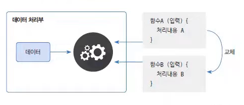
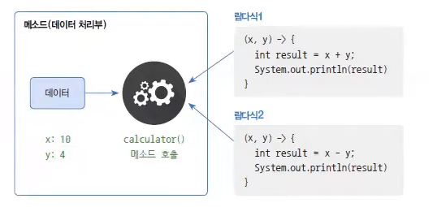

# 람다식 (Lambda Expression)

> 작성 일시: **2026-03-18 오후 4:03**

람다식은 **함수형 프로그래밍을 지원하기 위해 Java 8에서 도입된 문법**이다.

함수형 프로그래밍이란 **함수를 정의하고 이 함수를 데이터 처리 로직에 전달하여 데이터를 처리하는 방식**을 의미한다.

데이터 처리부에 데이터를 동일한데 외부에서 함수를 전달을 해서 데이터를 처리하는 프로그래밍



즉, 데이터 처리부는 **데이터만 가지고 있고 처리 방법은 외부에서 제공된 함수에 의존한다.**

```
데이터 + 처리함수 → 결과
```

같은 데이터라도 **어떤 함수를 전달하느냐에 따라 처리 결과가 달라질 수 있다.**

---

# 람다식 기본 문법

람다식은 **매개변수와 실행 블록을 이용하여 함수를 표현**한다.

```java
(매개변수, ...) -> { 실행문 }
```

예시

```java
(x, y) -> { System.out.println(x + y); }
```

구조

```
(매개변수) -> { 실행 코드 }
```

---

# 람다식 동작 원리

자바에서 람다식은 **인터페이스의 익명 구현 객체**로 변환된다.



즉, 다음 코드와 같은 의미를 가진다.

## 인터페이스 정의

```java
public interface Calculable {

    void calculate(int x, int y);

}
```

---

# 익명 구현 객체 방식

람다식이 나오기 전에는 다음과 같이 사용했다.

```java
Calculable calc = new Calculable() {

    @Override
    public void calculate(int x, int y) {
        int result = x + y;
        System.out.println(result);
    }

};
```

---

# 람다식 표현

위 코드를 람다식으로 표현하면 다음과 같다.

```java
Calculable calc = (x, y) -> {
    int result = x + y;
    System.out.println(result);
};
```

---

# 람다식을 매개변수로 전달

람다식은 **인터페이스 타입 매개변수에 전달할 수 있다.**

예시

```java
public class LambdaExample {

    public static void action(Calculable calculable) {

        int x = 10;
        int y = 20;

        calculable.calculate(x, y);

    }

}
```

---

# 람다식 호출

```java
LambdaExample.action((x, y) -> {
    int result = x + y;
    System.out.println(result);
});
```

실행 결과

```
30
```

---

# 함수형 인터페이스 (Functional Interface)

람다식을 사용하려면 **인터페이스가 단 하나의 추상 메소드만 가져야 한다.**

이러한 인터페이스를 **함수형 인터페이스**라고 한다.

```
추상 메소드 = 1개
```

예시

```java
public interface Calculable {

    void calculate(int x, int y);

}
```

---

# @FunctionalInterface

자바에서는 함수형 인터페이스임을 명확하게 하기 위해  
`@FunctionalInterface` 어노테이션을 사용할 수 있다.

```java
@FunctionalInterface
public interface Calculable {

    void calculate(int x, int y);

}
```

만약 **추상 메소드가 두 개 이상이면 컴파일 오류가 발생한다.**

---

# 함수형 인터페이스 예제

```java
@FunctionalInterface
public interface MyFunction {

    void method();

}
```

람다식 사용

```java
public class LambdaTest {

    public static void main(String[] args) {

        MyFunction f = () -> {
            System.out.println("람다식 실행");
        };

        f.method();

    }

}
```

실행 결과

```
람다식 실행
```

---

# 람다식 전체 예제

```java
@FunctionalInterface
interface Calculable {

    void calculate(int x, int y);

}

public class LambdaExample {

    public static void action(Calculable calculable) {

        int x = 10;
        int y = 20;

        calculable.calculate(x, y);

    }

    public static void main(String[] args) {

        action((x, y) -> {
            int result = x + y;
            System.out.println("결과: " + result);
        });

    }

}
```

출력

```
결과: 30
```

---

# 람다식 특징

```
코드가 간결해짐
익명 클래스 코드 감소
함수형 프로그래밍 지원
```

---

# 정리

람다식 문법

```
(매개변수) -> { 실행문 }
```

람다식 조건

```
인터페이스의 추상 메소드가 1개여야 한다
```

이를 **함수형 인터페이스(Functional Interface)** 라고 한다.

출처:
https://www.youtube.com/watch?v=iJIktCmxPnI&list=PLVsNizTWUw7EmX1Y-7tB2EmsK6nu6Q10q&index=154