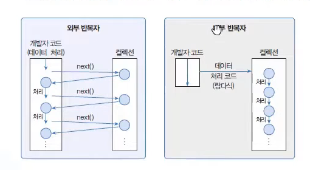
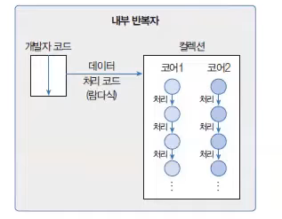

## 스트림(Stream)

> **작성 일시:** 2026-03-30 오후 2:39

지금까지 컬렉션 및 배열에 저장된 요소를 반복 처리하기 위해서는 `for문` 또는 `Iterator(반복자)`를 사용했다.

이 외에도 요소를 처리하는 또 다른 방법으로 **Stream**을 사용할 수 있다.

스트림(Stream)은 **데이터가 하나씩 흘러가면서 처리되는 방식**을 의미한다.

---

## 기본 사용법

```java
Stream<WrapperType> 변수명 = 컬렉션 변수.stream();
Stream<String> stream = list.stream();
stream.forEach(item -> System.out.println(item));
```

- `list.stream()` : 컬렉션 → 스트림 생성
- `forEach()` : 각 요소를 하나씩 처리 (최종 처리)
- 람다식을 통해 요소 처리 방식 정의

---

## 스트림의 특징

Stream은 Iterator와 비슷한 반복자이지만 다음과 같은 차이점이 있다.

1. **내부 반복자**이므로 처리 속도가 빠르고 병렬 처리에 효율적이다.
2. **람다식**으로 다양한 요소 처리를 정의할 수 있다.
3. **중간 처리 + 최종 처리**를 통해 파이프라인을 구성할 수 있다.

---

## 내부 반복자 vs 외부 반복자

### 외부 반복자 (for문, Iterator)



- 컬렉션의 요소를 for문과 Iterator를 이용해서  **외부로 가져와서 직접 처리**
- 개발자가 반복 로직을 직접 제어

```java
List<String> list = Arrays.asList("A", "B", "C");

for (String item : list) {
    System.out.println(item);
}
```

또는

```java
Iterator<String> iterator = list.iterator();
while (iterator.hasNext()) {
    System.out.println(iterator.next());
}
```

---

### 내부 반복자 (Stream)

- 요소 처리 로직을 **컬렉션 내부로 전달**
- 반복은 내부에서 수행되고, 개발자는 **처리 방식만 정의**



```java
list.stream()
    .forEach(item -> System.out.println(item));
```

---

## 내부 반복자의 장점

- 반복 로직을 직접 작성하지 않아도 됨
- 코드 가독성이 높음
- 멀티코어 CPU 활용 가능 (병렬 처리)
- 선언형 프로그래밍 방식

---

## 파이프라인 구조

스트림은 **중간 처리 + 최종 처리**로 구성된다.

```java
list.stream()                 // 스트림 생성
    .filter(item -> item.length() > 1)   // 중간 처리
    .map(item -> item.toLowerCase())     // 중간 처리
    .forEach(item -> System.out.println(item)); // 최종 처리
```

- **중간 처리 (Intermediate Operation)**
    - filter, map 등
    - 여러 번 연결 가능

- **최종 처리 (Terminal Operation)**
    - forEach, collect 등
    - 반드시 마지막에 한 번 실행

---

# 예제 코드

### 1. 기본 스트림 사용

```java
import java.util.Arrays;
import java.util.List;

public class StreamExample1 {

    public static void main(String[] args) {

        List<String> list = Arrays.asList("Java", "Spring", "JPA");

        list.stream()
            .forEach(item -> System.out.println(item));
    }
}
```

---

### 2. 중간 처리 + 최종 처리

```java
import java.util.Arrays;
import java.util.List;

public class StreamExample2 {

    public static void main(String[] args) {

        List<String> list = Arrays.asList("Java", "Spring", "JPA", "DB");

        list.stream()
            .filter(item -> item.length() >= 4)   // 길이가 4 이상
            .map(item -> item.toUpperCase())      // 대문자 변환
            .forEach(item -> System.out.println(item));
    }
}
```

---

### 3. 병렬 스트림

```java
import java.util.Arrays;
import java.util.List;

public class StreamExample3 {

    public static void main(String[] args) {

        List<String> list = Arrays.asList("A", "B", "C", "D");

        list.parallelStream()
            .forEach(item -> System.out.println(item + " : " + Thread.currentThread().getName()));
    }
}
```

---

## 실행 결과 예시

```
Java
Spring
JPA

JAVA
SPRING

A : ForkJoinPool.commonPool-worker-1
B : main
C : ForkJoinPool.commonPool-worker-2
D : main
```