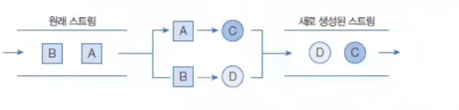
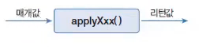
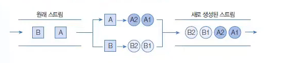

## 요소 변환 (매핑)

> **작성 일시:** 2026-03-31 오후 2:50

매핑(mapping)은 스트림의 요소를 **다른 요소로 변환하는 중간 처리(Intermediate Operation)** 기능이다.

즉, 기존 데이터를 가공하여 **새로운 형태의 데이터로 변환**할 때 사용된다.



---

## mapXxx() 메소드 종류

| 리턴 타입 | 메소드 | 요소 → 변환 요소 |
|----------|--------|------------------|
| Stream<R> | map(Function<T, R>) | T → R |
| IntStream | mapToInt(ToIntFunction<T>) | T → int |
| LongStream | mapToLong(ToLongFunction<T>) | T → long |
| DoubleStream | mapToDouble(ToDoubleFunction<T>) | T → double |
| Stream<U> | mapToObj(IntFunction<U>) | int → U |
| Stream<U> | mapToObj(LongFunction<U>) | long → U |
| Stream<U> | mapToObj(DoubleFunction<U>) | double → U |
| DoubleStream | mapToDouble(IntToDoubleFunction) | int → double |
| DoubleStream | mapToDouble(LongToDoubleFunction) | long → double |
| IntStream | mapToInt(DoubleToIntFunction) | double → int |
| LongStream | mapToLong(DoubleToLongFunction) | double → long |

---

## Function 함수형 인터페이스

모든 Function 계열 인터페이스는 **데이터를 변환(매핑)** 하는 역할을 한다.

| 인터페이스 | 변환 형태 |
|------------|----------|
| Function<T, R> | T → R |
| IntFunction<R> | int → R |
| LongFunction<R> | long → R |
| DoubleFunction<R> | double → R |
| ToIntFunction<T> | T → int |
| ToLongFunction<T> | T → long |
| ToDoubleFunction<T> | T → double |
| IntToLongFunction | int → long |
| IntToDoubleFunction | int → double |
| LongToIntFunction | long → int |
| LongToDoubleFunction | long → double |
| DoubleToIntFunction | double → int |
| DoubleToLongFunction | double → long |

---

## 람다식 형태



```java
T -> {
    return R;
}
```

또는 (축약형)

```java
T -> R
```

---

# 예제 코드

## 1. map() 기본 예제 (객체 → 객체)

```java
import java.util.Arrays;
import java.util.List;

public class StreamMapExample {

    public static void main(String[] args) {

        List<String> list = Arrays.asList("java", "spring", "jpa");

        list.stream()
            .map(item -> item.toUpperCase()) // 소문자 → 대문자
            .forEach(System.out::println);
    }
}
```

---

## 2. mapToInt() 예제 (객체 → 기본 타입)

```java
import java.util.Arrays;
import java.util.List;

public class StreamMapToIntExample {

    public static void main(String[] args) {

        List<String> list = Arrays.asList("Java", "Spring", "JPA");

        list.stream()
            .mapToInt(item -> item.length()) // 문자열 → 길이(int)
            .forEach(System.out::println);
    }
}
```

---

## 3. 객체 → 객체 (DTO 변환)

```java
import java.util.Arrays;
import java.util.List;

class Student {
    String name;
    int score;

    Student(String name, int score) {
        this.name = name;
        this.score = score;
    }
}

public class StreamMapExample2 {

    public static void main(String[] args) {

        List<Student> list = Arrays.asList(
                new Student("홍길동", 90),
                new Student("김자바", 80)
        );

        list.stream()
            .map(student -> student.name) // Student → String
            .forEach(System.out::println);
    }
}
```

---

# 래퍼 객체 요소 변환

기본 타입 스트림 ↔ 객체 스트림 변환

| 리턴 타입 | 메소드 | 설명 |
|----------|--------|------|
| LongStream | asLongStream() | int → long |
| DoubleStream | asDoubleStream() | int → double / long → double |
| Stream<Integer> | boxed() | int → Integer |
| Stream<Long> | boxed() | long → Long |
| Stream<Double> | boxed() | double → Double |

---

## 예제 코드

```java
import java.util.stream.IntStream;

public class StreamBoxedExample {

    public static void main(String[] args) {

        IntStream intStream = IntStream.rangeClosed(1, 5);

        intStream
            .boxed() // int → Integer
            .forEach(System.out::println);
    }
}
```

---

# 요소를 복수 개의 요소로 변환 (flatMap)

`flatMap()`은 **하나의 요소를 여러 개의 요소로 변환**한다.



---

## flatMap() 메소드 종류

| 리턴 타입 | 메소드 | 설명 |
|----------|--------|------|
| Stream<R> | flatMap(Function<T, Stream<R>>) | 객체 → 스트림 |
| IntStream | flatMapToInt(Function<T, IntStream>) | 객체 → IntStream |
| LongStream | flatMapToLong(Function<T, LongStream>) | 객체 → LongStream |
| DoubleStream | flatMapToDouble(Function<T, DoubleStream>) | 객체 → DoubleStream |

---

## flatMap() 예제 (문자열 분리)

```java
import java.util.Arrays;
import java.util.List;

public class StreamFlatMapExample {

    public static void main(String[] args) {

        List<String> list = Arrays.asList(
                "Java Spring",
                "JPA Hibernate"
        );

        list.stream()
            .flatMap(item -> Arrays.stream(item.split(" "))) // 문자열 → 단어
            .forEach(System.out::println);
    }
}
```

---

## 실행 결과

```
Java
Spring
JPA
Hibernate
```

---

## 핵심 정리

- `map()` : 1:1 변환 (요소 → 요소)
- `mapToXxx()` : 객체 → 기본 타입 변환
- `boxed()` : 기본 타입 → 객체 변환
- `flatMap()` : 1:N 변환 (요소 → 여러 요소)
- 매핑은 **데이터 가공의 핵심 중간 처리 연산**