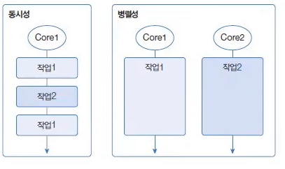
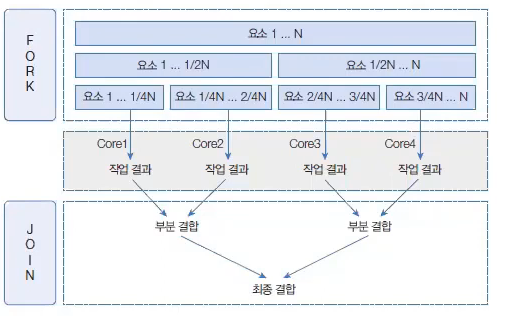
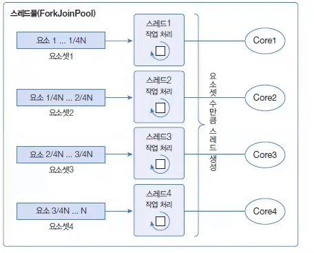

## 요소 병렬 처리 (Parallel Stream)

> 작성일시: 2026-04-03 오후 6:12

요소 병렬 처리란 **멀티 코어 CPU 환경에서 데이터를 분할하여 각 코어가 병렬적으로 처리하는 것**을 의미한다.

👉 목적: **작업 처리 시간 단축**

자바에서는 이를 위해 **병렬 스트림(Parallel Stream)** 을 제공한다.

---

# 동시성 vs 병렬성



## 1. 동시성 (Concurrency)

- 하나의 코어에서 여러 작업을 **번갈아 수행**
- 실제로는 동시에 실행되지 않음
- 빠른 전환으로 동시에 처리되는 것처럼 보임

---

## 2. 병렬성 (Parallelism)

- 여러 코어에서 **동시에 작업 수행**
- 실제로 동시에 실행됨
- 동시성보다 높은 성능

---

## 병렬성 종류

### 1. 데이터 병렬성

- 데이터를 분할하여 병렬 처리
- **병렬 스트림이 사용하는 방식**

### 2. 작업 병렬성

- 서로 다른 작업을 병렬 처리
- 예: 서버 요청 처리

---

# 포크-조인 프레임워크 (ForkJoin Framework)

병렬 스트림은 내부적으로 **포크-조인 프레임워크**를 사용한다.

## 동작 과정

1. **Fork 단계**
    - 데이터를 여러 개의 서브 데이터로 분할

2. **병렬 처리**
    - 각 데이터를 여러 스레드에서 처리

3. **Join 단계**
    - 결과를 결합하여 최종 결과 생성



---

## 구조 특징

- 스레드 풀 사용
- `ForkJoinPool` 기반
- `ExecutorService` 구현체 사용



---

# 병렬 스트림 생성 방법

## 메소드 종류

| 리턴 타입 | 메소드 | 설명 |
|----------|--------|------|
| Stream | parallelStream() | 컬렉션에서 바로 병렬 스트림 생성 |
| Stream | parallel() | 기존 스트림을 병렬 스트림으로 변환 |

---

# 예제 코드

## 1. parallelStream() 사용

```java
import java.util.Arrays;
import java.util.List;

public class ParallelStreamExample1 {

    public static void main(String[] args) {

        List<String> list = Arrays.asList("A", "B", "C", "D");

        list.parallelStream()
                .forEach(str -> {
                    System.out.println(str + " : " + Thread.currentThread().getName());
                });
    }
}
```

---

## 2. parallel() 사용

```java
import java.util.stream.IntStream;

public class ParallelStreamExample2 {

    public static void main(String[] args) {

        IntStream.range(1, 5)
                .parallel()
                .forEach(i -> {
                    System.out.println(i + " : " + Thread.currentThread().getName());
                });
    }
}
```

---

## 3. 순차 vs 병렬 성능 비교

```java
import java.util.stream.LongStream;

public class ParallelPerformanceExample {

    public static void main(String[] args) {

        long start, end;

        // 순차 스트림
        start = System.currentTimeMillis();

        long sum1 = LongStream.rangeClosed(1, 1_000_000_000L)
                .sum();

        end = System.currentTimeMillis();
        System.out.println("순차 처리 시간: " + (end - start));

        // 병렬 스트림
        start = System.currentTimeMillis();

        long sum2 = LongStream.rangeClosed(1, 1_000_000_000L)
                .parallel()
                .sum();

        end = System.currentTimeMillis();
        System.out.println("병렬 처리 시간: " + (end - start));
    }
}
```

---

## 4. 병렬 처리 주의 예제 (공유 자원 문제)

```java
import java.util.ArrayList;
import java.util.List;
import java.util.stream.IntStream;

public class ParallelDangerExample {

    public static void main(String[] args) {

        List<Integer> list = new ArrayList<>();

        // 비동기 문제 발생 가능
        IntStream.range(1, 1000)
                .parallel()
                .forEach(list::add);

        System.out.println("크기: " + list.size());
    }
}
```

👉 해결: 동기화 또는 안전한 컬렉션 사용

---

# 병렬 처리 성능 고려 요소

## 1. 요소 수 & 작업 비용

- 데이터가 적거나 연산이 가벼우면
  👉 **병렬보다 순차가 더 빠름**

---

## 2. 스트림 소스 종류

| 빠름 | 느림 |
|------|------|
| ArrayList, 배열 | LinkedList, HashSet |

👉 이유: 분할(Splitting) 효율 차이

---

## 3. CPU 코어 수

- 코어 많을수록 병렬 처리 유리
- 코어 적으면 오히려 성능 저하

---

# 핵심 정리

- 병렬 스트림 = 데이터 병렬 처리
- 내부적으로 ForkJoinPool 사용
- `parallelStream()` / `parallel()`로 생성
- 항상 빠른 것이 아님 (조건 중요)
- 공유 자원 사용 시 반드시 주의
- 대용량 + 고비용 연산일 때 효과적