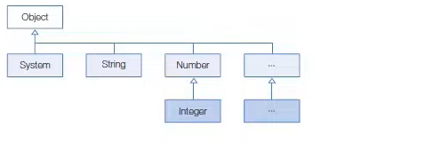
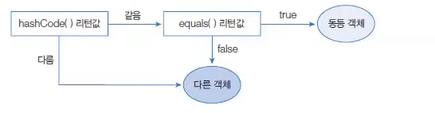

# Object 클래스

> 작성 일시: 2026-03-09 오후 15:00

## 1. Object 클래스 개요
클래스를 선언할 때 `extends` 키워드로 다른 클래스를 상속하지 않으면 자동으로 `java.lang.Object` 클래스를 상속한다.



즉, **모든 자바 클래스는 Object 클래스의 자식 또는 자손 클래스이다.**

따라서 **Object 클래스가 가진 메소드는 모든 객체에서 사용할 수 있다.**

### Object 클래스의 주요 메소드

| 메소드 | 설명 |
|------|------|
| protected Object clone() | 객체 자신의 **복사본을 반환**한다. |
| public boolean equals(Object obj) | 객체 자신과 객체 `obj`가 **같은 객체인지 비교**한다. 같으면 `true` 반환 |
| protected void finalize() | 객체가 소멸될 때 **가비지 컬렉터에 의해 호출되는 메소드**. 자원 정리에 사용되었지만 현재는 **deprecated** |
| public Class getClass() | 객체의 **클래스 정보(Class 객체)** 를 반환 |
| public int hashCode() | 객체의 **해시코드 값을 반환** |
| public String toString() | 객체의 **문자열 정보를 반환** |
| public void notify() | (쓰레드 메소드) 객체의 **대기중인 쓰레드 하나를 깨움** |
| public void notifyAll() | (쓰레드 메소드) 객체의 **대기중인 모든 쓰레드를 깨움** |
| public void wait() | 다른 쓰레드가 `notify()` 또는 `notifyAll()`을 호출할 때까지 **대기** |
| public void wait(long timeout) | 지정한 시간 동안 쓰레드를 **대기 상태로 만듦** |
| public void wait(long timeout, int nanos) | 지정된 시간(`timeout`, `nanos`) 동안 **대기** |

---

# 2. 객체 동등 비교 (equals)

`Object`의 `equals()` 메소드는 **객체의 번지를 비교**하고 `boolean` 값을 리턴한다.

```java
public boolean equals(Object obj)
```

매개변수 타입이 `Object`이기 때문에 **모든 객체가 자동 타입 변환되어 전달될 수 있다.**

기본적으로 `equals()` 메소드는 **비교 연산자 `==` 와 동일한 결과**를 리턴한다.

- 같은 객체 → `true`
- 다른 객체 → `false`

### 기본 동작 예제

```java
Object obj1 = new Object();
Object obj2 = obj1;

boolean result1 = obj1.equals(obj2); // true
boolean result2 = (obj1 == obj2);    // true
```

하지만 일반적으로 `equals()`는 **재정의(Override)** 해서  
**객체의 내부 데이터가 같은지 비교하는 용도로 사용한다.**


### equals 재정의 예제

```java
class Member {

    String id;

    Member(String id){
        this.id = id;
    }

    @Override
    public boolean equals(Object obj){

        if(obj instanceof Member){
            Member target = (Member) obj;
            return this.id.equals(target.id);
        }

        return false;
    }
}
```

사용 예시

```java
Member m1 = new Member("java");
Member m2 = new Member("java");

System.out.println(m1.equals(m2)); // true
```

---

# 3. 객체 해시코드 (hashCode)

**객체 해시코드(HashCode)** 는 객체를 식별할 수 있는 **정수 값**이다.

`Object`의 `hashCode()` 메소드는 **객체의 메모리 번지를 기반으로 해시코드를 생성**한다.

```java
public int hashCode()
```

따라서 **객체마다 다른 정수값을 리턴한다.**

### 일반적인 사용 방식

자바에서는 객체의 동등 비교를 할 때 다음과 같은 순서로 비교하는 경우가 많다.

1️⃣ `hashCode()` 값이 같은지 확인  
2️⃣ `equals()` 메소드로 실제 데이터 비교



### hashCode 재정의 예제

```java
class Member {

    String id;

    Member(String id){
        this.id = id;
    }

    @Override
    public int hashCode(){
        return id.hashCode();
    }

    @Override
    public boolean equals(Object obj){

        if(obj instanceof Member){
            Member target = (Member) obj;
            return this.id.equals(target.id);
        }

        return false;
    }
}
```

---

# 4. 객체 문자 정보 (toString)

`Object`의 `toString()` 메소드는 **객체의 문자 정보를 리턴한다.**

객체의 문자 정보란 **객체를 문자열로 표현한 값**을 의미한다.

따라서 객체의 문자 정보가 중요한 경우에는 Object의 toString()  메소드를 재정의 해서 간결하고 유익한 정보를 리턴해야한다.


기본 형식

```
클래스명@16진수해시코드
```

### 기본 사용 예제

```java
Object obj = new Object();

System.out.println(obj.toString());
```

출력 예

```
java.lang.Object@15db9742
```

### toString 재정의 예제

```java
class Member {

    String id;
    String name;

    Member(String id, String name){
        this.id = id;
        this.name = name;
    }

    @Override
    public String toString(){
        return "Member{id='" + id + "', name='" + name + "'}";
    }
}
```

사용 예

```java
Member member = new Member("java", "홍길동");

System.out.println(member);
```

출력

```
Member{id='java', name='홍길동'}
```

---

# 5. 레코드(Record)

데이터 전달용 객체인 **DTO(Data Transfer Object)** 를 만들 때  
반복되는 코드를 줄이기 위해 **Record**가 도입되었다.

### 기본 문법

```java
public record 클래스명(필드1, 필드2, ...) {
}
```

### 예제

```java
public record Member(String id, String name) {
}
```

컴파일 시 자동 생성되는 것

- `private final` 필드
- 생성자
- Getter 메소드
- `equals()`
- `hashCode()`
- `toString()`

### 사용 예제

```java
Member member = new Member("java", "홍길동");

System.out.println(member.id());
System.out.println(member.name());
System.out.println(member);
```

---

# 6. Lombok

**Lombok**은 JDK 표준 라이브러리는 아니지만 자바 개발에서 매우 많이 사용하는 **자동 코드 생성 라이브러리**이다.

DTO 클래스를 작성할 때 다음 메소드를 자동 생성한다.

- Getter
- Setter
- equals()
- hashCode()
- toString()

### Record와의 차이점

| Record | Lombok |
|------|------|
| 필드가 final | 필드가 final이 아님 |
| Setter 없음 | Setter 생성 가능 |
| Getter 이름 → 필드명() | Getter → getXxx() |

---

# 7. Lombok 주요 어노테이션

| 어노테이션 | 설명 |
|------|------|
| @Data | Getter, Setter, toString, equals, hashCode 자동 생성 |
| @NoArgsConstructor | 기본 생성자 생성 |
| @RequiredArgsConstructor | final 필드 기반 생성자 생성 |
| @Getter | Getter 생성 |
| @Setter | Setter 생성 |
| @EqualsAndHashCode | equals, hashCode 생성 |
| @ToString | toString 생성 |

### Lombok 사용 예제

```java
import lombok.Data;

@Data
public class Member {

    private String id;
    private String name;
}
```

사용 예

```java
Member member = new Member();

member.setId("java");
member.setName("홍길동");

System.out.println(member.getId());
System.out.println(member);
```

출처:

https://inpa.tistory.com/entry/JAVA-%E2%98%95-Object-%ED%81%B4%EB%9E%98%EC%8A%A4%EC%99%80-%EC%83%81%EC%9C%84-%EB%A9%94%EC%84%9C%EB%93%9C-%EC%9E%AC%EC%A0%95%EC%9D%98-%ED%99%9C%EC%9A%A9-%EC%B4%9D%EC%A0%95%EB%A6%AC

https://www.youtube.com/watch?v=GK-oE509wKA&list=PLVsNizTWUw7EmX1Y-7tB2EmsK6nu6Q10q&index=122