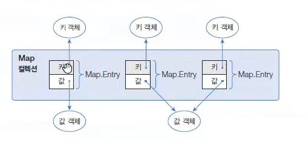
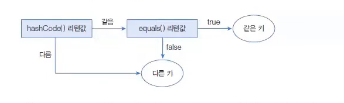
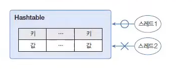

# Map 컬렉션

> 작성 일시: 2026-03-16 오후 6:30

Map 컬렉션은 **키(Key)와 값(Value)으로 구성된 Entry 객체를 저장하는 컬렉션**이다.

여기서 **Key와 Value는 모두 객체이다.**
```
Key → Value
```


Map 컬렉션의 특징

```
Key는 중복 저장 불가 -> 식별하기 위해서 중복이 되서는 안된다.
Value는 중복 저장 가능
```

만약 **기존에 있는 Key와 동일한 Key로 값을 저장하면 기존 값이 새로운 값으로 대체된다.**


---

# Map 구현 클래스

대표적인 Map 구현 클래스

```
HashMap
Hashtable
LinkedHashMap
Properties
TreeMap
```

Map 컬렉션은 **Key를 기준으로 데이터를 관리하기 때문에 Key를 매개값으로 사용하는 메소드가 많다.**

---

# Map 인터페이스 주요 메소드

| 기능 | 메소드 | 설명 |
|---|---|---|
객체 추가 | V put(K key, V value) | 키와 값을 저장하고 이전 값 반환 |
객체 검색 | boolean containsKey(Object key) | 주어진 키 존재 여부 |
객체 검색 | boolean containsValue(Object value) | 주어진 값 존재 여부 |
객체 검색 | Set<Map.Entry<K,V>> entrySet() | 키와 값의 쌍(Set) 반환 |
객체 검색 | V get(Object key) | 키에 해당하는 값 반환 |
객체 검색 | boolean isEmpty() | 컬렉션이 비어있는지 확인 |
객체 검색 | Set<K> keySet() | 모든 키 반환 |
객체 검색 | int size() | 저장된 키 개수 반환 |
객체 검색 | Collection<V> values() | 모든 값 반환 |
객체 삭제 | void clear() | 모든 엔트리 삭제 |
객체 삭제 | V remove(Object key) | 해당 키 엔트리 삭제 |

---

# HashMap

HashMap은 **Map 컬렉션 중에서 가장 많이 사용하는 클래스**이다.

HashMap은 **해시 알고리즘(Hash Algorithm)** 을 사용하여 데이터를 저장한다.

---

# HashMap 중복 Key 판단 기준

HashMap은 다음 두 메소드를 사용하여 **Key 중복 여부를 판단한다.**

```
hashCode()
equals()
```

조건

```
hashCode() 값이 같고
equals() 결과가 true
```

이면 **동일한 Key로 판단하여 기존 값이 새로운 값으로 대체된다.**



---

# HashMap 생성 방법

```java
Map<K, V> map = new HashMap<K, V>();
```

예

```java
Map<String, Integer> map = new HashMap<String, Integer>();
Map<String, Integer> map = new HashMap<>();
```

설명

```
Key → String
Value → Integer
```

모든 타입의 객체를 저장할 수도 있지만 실제로는 거의 사용하지 않는다.

```java
Map map = new HashMap();
```

---

# HashMap 예제 코드

```java
import java.util.HashMap;
import java.util.Map;

public class HashMapExample {

    public static void main(String[] args) {

        Map<String, Integer> map = new HashMap<>();

        map.put("Java", 90);
        map.put("Spring", 95);
        map.put("Database", 85);

        System.out.println(map);

        System.out.println("Java 점수: " + map.get("Java"));

        map.put("Java", 100);

        System.out.println("Java 점수 수정: " + map.get("Java"));

        System.out.println("크기: " + map.size());

    }

}
```

출력

```
{Java=90, Spring=95, Database=85}
Java 점수: 90
Java 점수 수정: 100
크기: 3
```

---

# Map 반복 방법

Map은 **Key와 Value를 함께 관리하기 때문에 Entry 객체를 사용하여 반복하는 경우가 많다.**

---

# Entry 반복 예제

```java
import java.util.HashMap;
import java.util.Map;
import java.util.Set;

public class MapEntryExample {

    public static void main(String[] args) {

        Map<String, Integer> map = new HashMap<>();

        map.put("Java", 90);
        map.put("Spring", 95);
        map.put("Database", 85);

        Set<Map.Entry<String, Integer>> entrySet = map.entrySet();

        for(Map.Entry<String, Integer> entry : entrySet){

            String key = entry.getKey();
            Integer value = entry.getValue();

            System.out.println(key + " : " + value);

        }

    }

}
```

---

# Hashtable

Hashtable은 **HashMap과 동일한 내부 구조**를 가지고 있다.

차이점

```
Hashtable → 동기화(Synchronized)
HashMap → 비동기
```

Hashtable은 **멀티 스레드 환경에서 안전하게 객체 추가, 삭제를 할 수 있다.**



---

# Hashtable 생성 방법

```java
Map<String, Integer> map = new Hashtable<String, Integer>();
Map<String, Integer> map = new Hashtable<>();
```

모든 타입 저장  이런경우는 거의없다.


```java
Map map = new Hashtable();
```

---

# Hashtable 예제 코드

```java
import java.util.Hashtable;
import java.util.Map;

public class HashtableExample {

    public static void main(String[] args) {

        Map<String, Integer> map = new Hashtable<>();

        map.put("Java", 90);
        map.put("Spring", 95);
        map.put("Database", 85);

        System.out.println(map);

    }

}
```

---

# Properties

Properties는 **Hashtable의 자식 클래스**이다.

따라서 **Hashtable의 특징을 그대로 가진다.**

Properties의 특징

```
Key 타입 → String
Value 타입 → String
```

Properties는 주로 **.properties 파일을 읽을 때 사용한다.**

---

# properties 파일 예시

```
database.url=jdbc:mysql://localhost:3306/test
database.username=root
database.password=1234
```

properties 파일 특징

```
Key = Value 구조
텍스트 파일
설정 정보 저장
```

---

# Properties 파일 읽기

Properties를 사용하면 **프로퍼티 파일을 쉽게 읽을 수 있다.**

```java
Properties properties = new Properties();
properties.load(Xxx.class.getResourceAsStream("database.properties"));
```

설명

```
getResourceAsStream()
→ 클래스 기준 상대 경로 파일을 읽어 InputStream 반환
```

일반적으로 **프로퍼티 파일은 클래스 파일과 같은 경로에 위치한다.**

---

# Properties 예제 코드

```java
import java.io.InputStream;
import java.util.Properties;

public class PropertiesExample {

    public static void main(String[] args) throws Exception {

        Properties properties = new Properties();

        InputStream input = PropertiesExample.class
                .getResourceAsStream("database.properties");

        properties.load(input);

        String url = properties.getProperty("database.url");
        String username = properties.getProperty("database.username");
        String password = properties.getProperty("database.password");

        System.out.println(url);
        System.out.println(username);
        System.out.println(password);

    }

}
```

---

# 정리

```
Map 특징
Key - Value 구조
Key 중복 불가
Value 중복 가능
```

대표 구현 클래스

```
HashMap
Hashtable
LinkedHashMap
TreeMap
Properties
```

가장 많이 사용하는 Map

```
HashMap
```