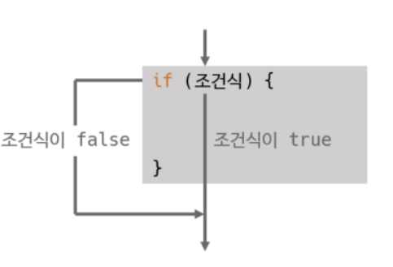
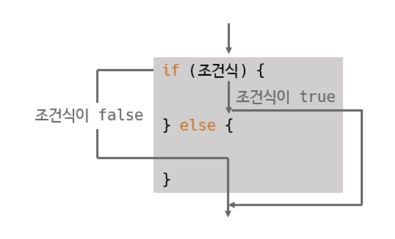
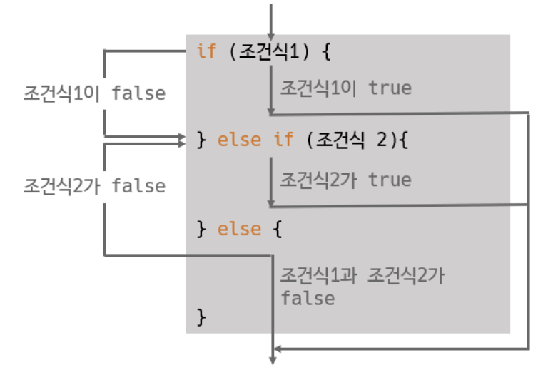
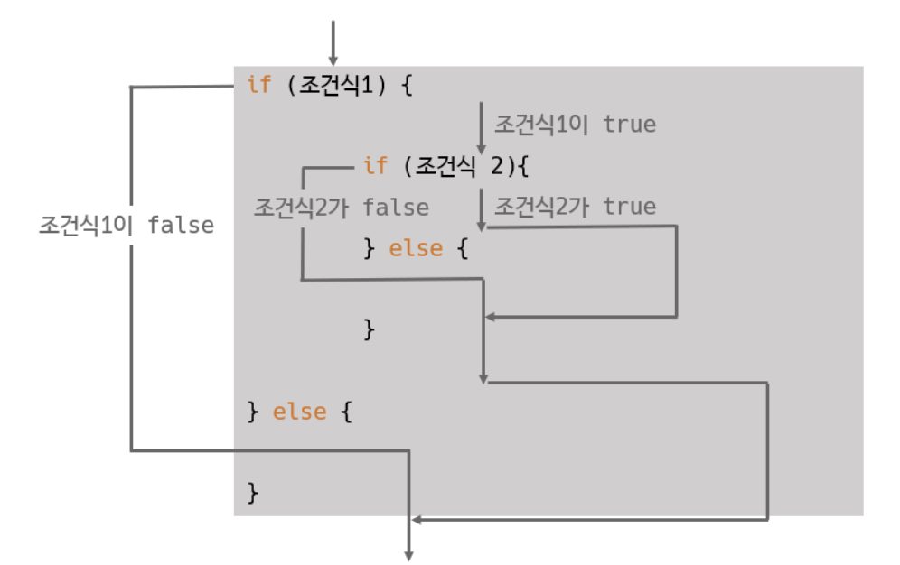
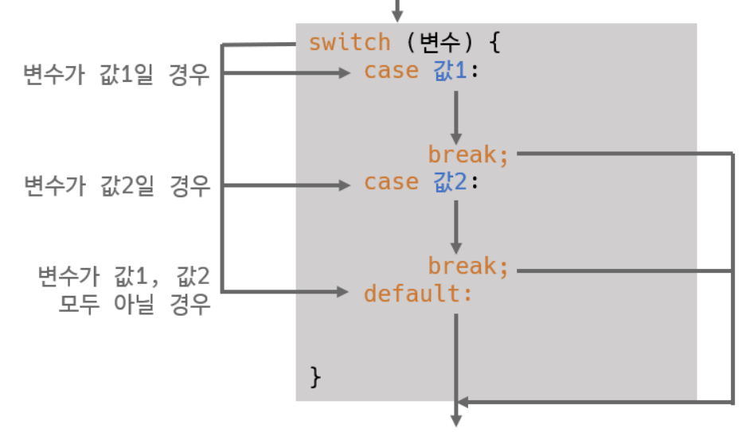

# 🔀 제어문 (Conditional Statements)

> **작성 일시:** 2026-02-25 오후 2:53

---

## 1. 제어문이란?

제어문은 **프로그램의 실행 흐름을 제어하는 문장**이다.

1.조건에 따라 실행할 코드를 선택.  
2.특정 상황에서 다른 동작을 수행.

대표적인 제어문:

- if문
- switch문

---

# 2. if문

## ✨ 개념

if문은 **조건식의 결과에 따라 실행 여부가 결정되는 제어문**이다.

조건식에는 다음이 올 수 있다.

- true / false 값을 반환하는 연산식
- boolean 타입 변수

조건식의 결과:

- true → 블록 실행
- false → 블록 실행하지 않음

---

## 📌 기본 구조

```java
if (조건식) {
    실행문;
    실행문;
}
```


---

## 📌 중괄호 생략 가능 조건

실행문이 **한 줄만 있을 경우** 중괄호 생략 가능하다.

```java
if (조건식)
    실행문;
```

단, 가독성을 위해 보통 중괄호 사용을 권장한다.

---

## 💻 예시

```java
int score = 80;

if (score >= 60) {
    System.out.println("합격");
}
```

---

# 3. if - else 문

## ✨ 개념

조건식이 거짓일 때 실행할 코드를 지정할 수 있다.

---

## 📌 구조

```java
if (조건식) {
    참일 때 실행할 문장;
} else {
    거짓일 때 실행할 문장;
}
```

---

## 💻 예시

```java
int score = 50;

if (score >= 60) {
    System.out.println("합격");
} else {
    System.out.println("불합격");
}
```

---

# 4. else if 문

## ✨ 개념

조건이 여러 개인 경우 사용한다.

동작 순서:

1. 위에서부터 조건 검사
2. 처음으로 true인 블록만 실행
3. 나머지는 실행되지 않음

---

## 📌 구조

```java
if (조건식1) {
    실행문;
} else if (조건식2) {
    실행문;
} else {
    모든 조건이 거짓일 때 실행;
}
```


---

## 💻 예시

```java
int score = 85;

if (score >= 90) {
    System.out.println("A");
} else if (score >= 80) {
    System.out.println("B");
} else if (score >= 70) {
    System.out.println("C");
} else {
    System.out.println("F");
}
```

---

# 5. 중첩 if문

## ✨ 개념

if문 내부에 또 다른 if문이 포함된 구조를 **중첩 조건문**이라고 한다.

즉,

> 하나의 조건문 블록 안에 다른 조건문 전체가 들어가는 구조

---

## 📌 구조

```java
if (바깥조건) {

    if (안쪽조건1) {
        실행문;
    } else if (안쪽조건2) {
        실행문;
    } else {
        실행문;
    }

} else {
    실행문;
}
```



---

## 💻 예시

```java
int score = 85;
boolean attendance = true;

if (attendance) {
    if (score >= 80) {
        System.out.println("우수 학생");
    } else {
        System.out.println("일반 학생");
    }
} else {
    System.out.println("출석 부족");
}
```

---

# 6. switch문

## ✨ 개념

if문은 조건이 많아질수록 else if가 반복되어 코드가 복잡해진다.

switch문은 **변수의 값에 따라 실행할 문장을 선택하는 제어문**이다.

따라서,

> 값 비교가 많은 경우 if문보다 코드가 간결하다.

---

## 📌 기본 구조

```java
switch (변수) {

    case 값1:
        실행문;
        break;

    case 값2:
        실행문;
        break;

    default:
        모든 case에 해당하지 않을 때 실행;
}
```

---

## 📌 break의 역할 (중요 ⭐)

break는 다음 역할을 한다.

- switch문을 즉시 종료
- 다음 case 실행을 막음

break가 없으면 **fall-through**가 발생하여 아래 case까지 계속 실행된다.

---

## 💻 예시 1 — 기본 switch

```java
int num = 2;

switch (num) {
    case 1:
        System.out.println("1입니다");
        break;

    case 2:
        System.out.println("2입니다");
        break;

    case 3:
        System.out.println("3입니다");
        break;

    default:
        System.out.println("기타 숫자");
}
```

---

## 💻 예시 2 — break 없는 경우 (fall-through)

```java
int num = 1;

switch (num) {
    case 1:
        System.out.println("1 실행");

    case 2:
        System.out.println("2 실행");
}
```

출력 결과:

```
1 실행
2 실행
```

---

# 💡 한 줄 정리

if문  
→ 조건식이 true / false 인지에 따라 실행 결정

else if  
→ 여러 조건을 순서대로 검사

중첩 if  
→ 조건문 안에 또 다른 조건문

switch문  
→ 변수의 값에 따라 실행 분기  
→ 값 비교가 많을 때 사용

