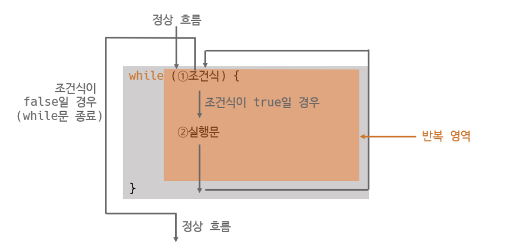

# 🔁 반복문 (Loop Statements)

> **작성 일시:** 2026-02-25 오후 3:42

---

## 1. 반복문이란?

프로그램을 작성하다 보면 **같은 실행문을 여러 번 반복**해야 하는 경우가 자주 발생한다.

예를 들어,

```
실행문;
실행문;
실행문;
...
```

이처럼 동일한 코드를 여러 번 작성하는 것은 비효율적이다.

👉 반복문을 사용하면 **코드를 한 번만 작성하고 여러 번 실행**할 수 있다.

대표적인 반복문:

- for문
- while문
- do-while문

---

# 2. for문

## ✨ 개념

for문은 **반복 횟수가 정해져 있을 때 사용하는 반복문**이다.

---

## 📌 기본 구조


```java
for (초기화식; 조건식; 증감식) {
    실행문;
}
```


구성 요소 설명:

- 초기화식 → 반복 시작 변수 설정
- 조건식 → 반복 실행 여부 판단
- 증감식 → 반복 횟수 증가/감소

---

## 💻 기본 예제

```java
for (int i = 1; i <= 5; i++) {
    System.out.println(i);
}
```

출력 결과:

```
1 2 3 4 5
```

---

## 📌 중괄호 생략 가능

실행문이 한 줄일 경우 생략 가능하다.

```java
for (int i = 1; i <= 5; i++)
    System.out.println(i);
```

---

# 3. 중첩 for문 (다중 for문)

## ✨ 개념

for문 안에 또 다른 for문이 포함된 구조를  
**중첩 for문**이라고 한다.

동작 방식:

- 바깥 for문이 1번 실행될 때
- 안쪽 for문은 지정 횟수만큼 반복 실행

---

## 💻 예제

```java
for (int i = 0; i < 3; i++) {
    for (int j = 0; j < 5; j++) {
        System.out.print("1");
    }
    System.out.println();
}
```

출력 결과:

```
11111
11111
11111
```

---

## 📌 동작 원리 이해

- i 변수 → 세로(행) 반복
- j 변수 → 가로(열) 반복

즉,
행(i) × 열(j) 구조로 출력된다.

---

## 📊 반복 흐름 구조

```
i = 0 → j 5번 반복 → 한 줄 출력
i = 1 → j 5번 반복 → 한 줄 출력
i = 2 → j 5번 반복 → 한 줄 출력
```

---

# 4. while문

## ✨ 개념

while문은 **조건식이 true인 동안 계속 반복**하는 반복문이다.

for문과의 차이:

- for문 → 반복 횟수 중심
- while문 → 조건 중심

---

## 📌 기본 구조

```java
while (조건식) {
    실행문;
}
```


---

## 💻 예제

```java
int i = 1;

while (i <= 5) {
    System.out.println(i);
    i++;
}
```

---

## ⚠️ 무한 반복

조건식에 true를 사용하면 **무한 반복**이 발생한다.

```java
while (true) {
    실행문;
}
```

무한 반복을 종료하려면:

- 조건식 변경
- break문 사용

---

# 5. do-while문

## ✨ 개념

do-while문은 while문과 동일하게 조건식으로 반복을 제어한다.

하지만 **실행 순서가 다르다.**

---

## 📌 핵심 차이

- while문 → 조건 검사 후 실행
- do-while문 → 실행 후 조건 검사

>즉,
 최소 1번은 반드시 실행된다.

---

## 📌 기본 구조

```java
do {
    실행문;
} while (조건식);
```


---

## 💻 예제

```java
int i = 1;

do {
    System.out.println(i);
    i++;
} while (i <= 5);
```

---

# 6. break문

## ✨ 개념

break문은 **반복문을 즉시 종료하는 제어문**이다.

사용 가능한 곳:

- for문
- while문
- do-while문
- switch문


---

## 💻 예제

```java
for (int i = 1; i <= 10; i++) {
    if (i == 5) {
        break;
    }
    System.out.println(i);
}
```

출력:

```
1 2 3 4
```

---

# 7. continue문

## ✨ 개념

continue문은 **현재 반복만 건너뛰고 다음 반복으로 이동**하는 제어문이다.

반복문에서만 사용 가능:

- for문
- while문
- do-while문

---

## 📌 break와 차이

- break → 반복문 완전히 종료
- continue → 다음 반복으로 이동

---

## 💻 예제

```java
for (int i = 1; i <= 5; i++) {

    if (i == 3) {
        continue;
    }

    System.out.println(i);
}
```

출력:

```
1 2 4 5
```

---

# 💡 한 줄 정리

for문  
→ 반복 횟수가 정해져 있을 때 사용

while문  
→ 조건이 참인 동안 반복

do-while문  
→ 최소 1번은 반드시 실행

break  
→ 반복문 즉시 종료

continue  
→ 현재 반복만 건너뛰고 다음 반복 실행


