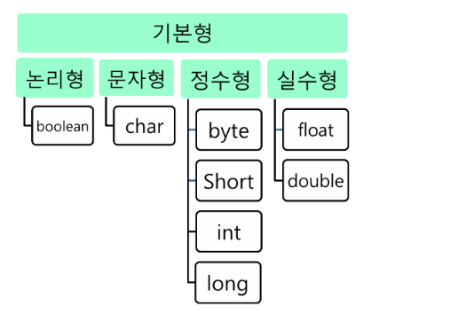
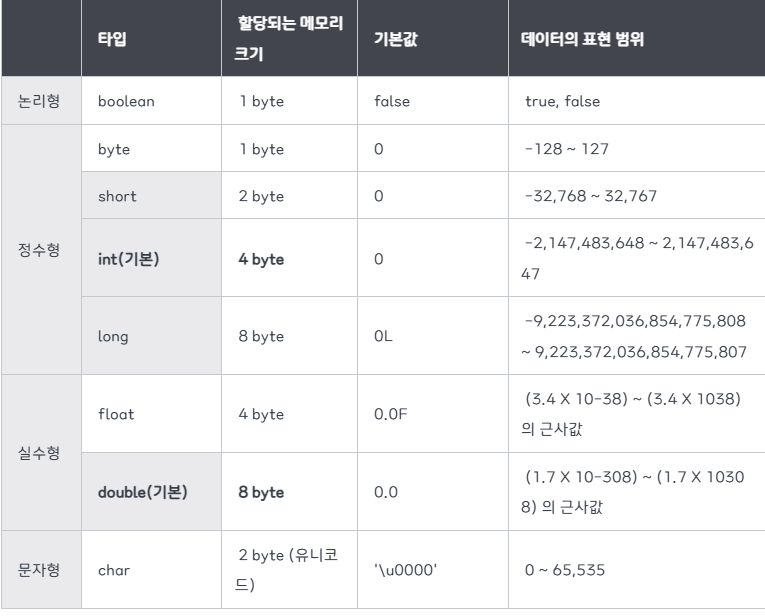
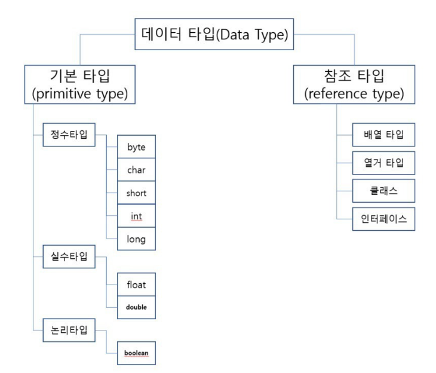
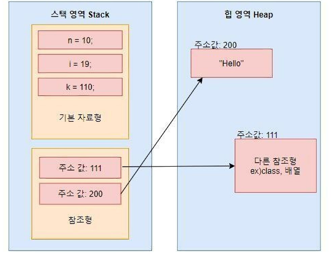
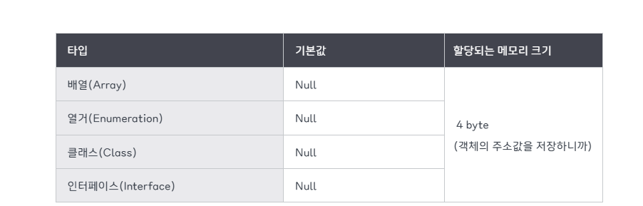

# 📦 변수와 데이터 타입 (Variables & Data Types)

> **작성 일시:** 2026-02-23 오후 2:56

---

## 1. 변수 선언의 이해

### 💻 메모리와 프로그램
* **메모리(RAM):** 수많은 번지들로 구성된 데이터 저장 공간입니다.
* **프로그램:** 데이터를 메모리에 저장하고 읽는 작업을 빈번히 수행합니다.

### 📍 변수(Variable)
* **정의:** 하나의 값을 저장할 수 있는 **메모리 번지에 붙여진 이름**입니다.
* **자바 변수의 특징:** 자바의 변수는 다양한 타입의 값을 저장할 수 없습니다.
    * 즉, **정수형**에는 정수값만 저장 가능하며, **실수형**에는 실수값만 저장 가능합니다.

```java
int birthDay = 25; // 정수 값 생일을 저장하는 birthDay 변수 선언 및 초기화
```

---

## 1. 기본형 타입 (Primitive Type)

기본형에는 논리형(`boolean`), 문자형(`char`), 정수형(`byte`, `short`, `int`, `long`), 실수형(`float`, `double`)이 있다.



### ✨ 주요 특징
1. **소문자 시작:** 모든 기본형 타입은 소문자로 시작합니다.
2. **비객체 타입:** 객체가 아니므로 `null`을 가질 수 없으며, 참조값을 가질 수 없다.
3. **즉시 생성:** 변수를 선언함과 동시에 메모리 공간이 생성.
4. **스택(Stack) 저장:** 모든 기본형 값은 메모리의 **스택 영역**에 직접 저장.
5. **실제 값 보유:** 저장 공간(변수) 내에 주소가 아닌 **실제 자료 값**을 가짐.



---

## 2. 참조형 타입 (Reference Type)

기본형 타입 자료형을 제외한 나머지 모든 타입.

1. 기본형과 달리 실제 값이 저장되지 않고, 자료가 저장된 공간의 주소를 저장
2. 즉, 실제값으 다른곳에 존재하며 주소를 가지고 있어서 나중에 그 주소를 참조해서 값을 가져옴.
3. 메모리의 힙(heap)에 실제 값을 저장하고, 그 참조값(주소값)을 갖는 변수는 스택에 저장
4. 참조현 변수는 null로 초기화 시킬 수 있다.




### 🔍 종류 및 특징
* **종류:** * 자바에서 기본적으로 제공하는 클래스 (예: `String`)
    * 프로그래머가 직접 만든 클래스(Class)
    * 배열(Array), 열거(Enum) 타입 등
* **특징:** * 실제 데이터(객체)는 **힙(Heap)** 메모리에 저장.
    * 변수(스택 영역)에는 실제 값이 아닌, 데이터가 저장된 메모리의 **주소(참조값)**를 저장.

---

## 💡 한 줄 정리
* **기본형:** 변수라는 상자 안에 **진짜 물건(값)이** 들어있음.
* **참조형:** 변수라는 상자 안에 물건이 어디 있는지 적힌 **쪽지(주소)가** 들어있음.